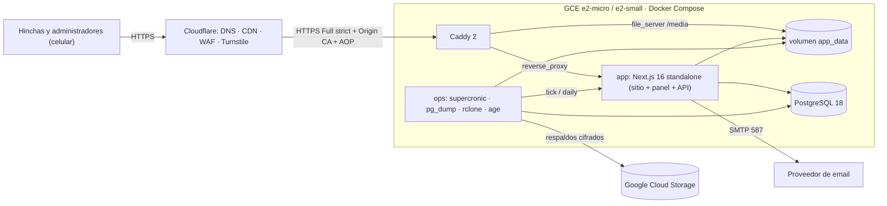
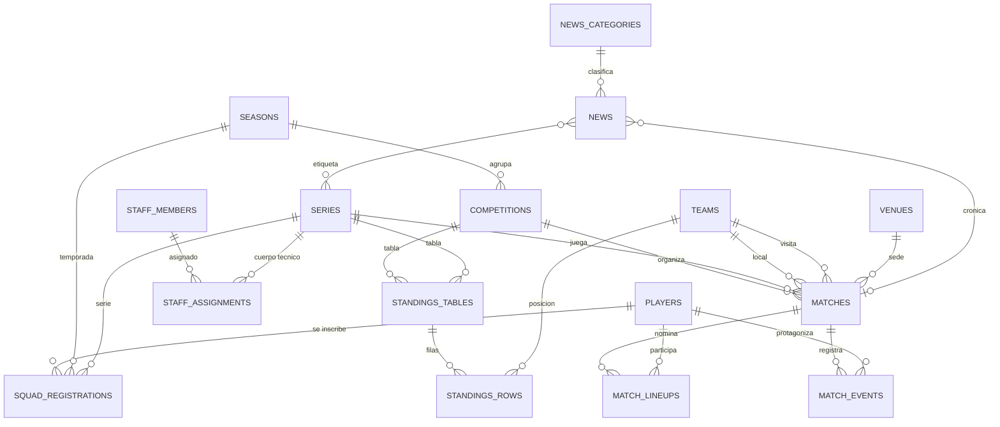

# Especificación Técnica v2.0 — Sitio Web Oficial del Club Deportivo Los Cachorros

> **Documento maestro (prompt) para ejecución por un agente de código** (Claude Code, Cursor, Codex u otro) **o por un desarrollador full-stack senior.**
> Versión 2.0 · Referencia tecnológica verificada a octubre de 2026 · Producto 100 % en español de Chile.
>
> Las palabras **DEBE**, **NO DEBE**, **DEBERÍA** y **PUEDE** se interpretan como en RFC 2119.

---

## Resumen ejecutivo

- **Qué:** la web (propuesta de web oficial) del **Club Deportivo Los Cachorros**, club de fútbol amateur ANFA fundado el **1 de abril de 1934** en **Sagrada Familia, Región del Maule, Chile**. Debe verse y funcionar como la web de un club profesional, adaptada a un club de comuna: pocos administradores, presupuesto mínimo y señal móvil irregular en la cancha.
- **Stack (vinculante):** Next.js 16 (App Router, RSC, Server Actions, Cache Components) · TypeScript estricto · Tailwind CSS v4 + shadcn/ui · PostgreSQL 18 + Drizzle ORM · Better Auth · Zod 4 · sharp · `next/og`.
- **Infraestructura:** una VM pequeña de Google Cloud (e2-micro / e2-small, 1–2 GB de RAM) con Docker Compose (Caddy + app + PostgreSQL + ops) detrás de Cloudflare (SSL Full strict). Las imágenes Docker se construyen en GitHub Actions y se publican en GHCR: **nunca se compila en la VM**.
- **Tiempo real:** polling liviano + micro-caché en el borde de Cloudflare: la carga del servidor no crece con la audiencia.
- **Imágenes:** se procesan una sola vez al subir (variantes WebP), las sirve Caddy y las cachea Cloudflare.
- **Entrega:** 6 fases (0–5), cada una con criterios de aceptación verificables y aprobación explícita antes de avanzar.

---

## 0. Instrucciones para el agente

### 0.1 Rol y fuente de verdad

Eres el ingeniero full-stack senior responsable de implementar este sitio de punta a punta. Este documento es la **fuente de verdad**. Las decisiones de arquitectura y stack son **vinculantes**: no se reabren por preferencia. Si encuentras un impedimento real (API deprecada, incompatibilidad, bug bloqueante, presupuesto de memoria inalcanzable), escribe un ADR en `docs/adr/NNNN-titulo.md` (contexto → opciones → propuesta → consecuencias) y espera aprobación antes de desviarte.

### 0.2 Protocolo de trabajo

1. **Arranque (antes de escribir código de producto):**
   - Guarda este documento como `docs/ESPECIFICACION.md`. Crea `AGENTS.md` con las reglas de trabajo, comandos y convenciones (resumen de las secciones 0 y 3) y un `CLAUDE.md` que lo referencie, para que cualquier agente las cargue.
   - Verifica la versión estable vigente de cada dependencia del stack (sección 2.1) y entrega una tabla: dependencia · versión elegida · diferencias relevantes con este documento (APIs renombradas, cambios mayores).
   - Presenta el plan detallado de la Fase 0 (tareas, orden, riesgos) y **espera aprobación**.
2. **Por fases** (sección 14). No avances de fase sin aprobación explícita. Una rama por fase (`fase-1-diseno-y-portada`) y un PR con el checklist de criterios de aceptación.
3. **Cierre de fase:** `pnpm check`, `pnpm test`, `pnpm test:e2e` y `pnpm build` en verde; todo funcionando en local con el seed; reporte en `docs/fases/fase-N.md` con: qué quedó hecho, qué falta, desviaciones (ADRs), cómo probarlo y capturas a 360 px y 1280 px.
4. **Commits** pequeños y atómicos, Conventional Commits en español: `feat(partidos): agrega tabla de posiciones manual`, `fix(en-vivo): evita goles duplicados sin conexión`.
5. **Dependencias:** solo las del stack. Cualquier otra se justifica en el PR (peso, mantenimiento, licencia, alternativa nativa de la plataforma).
6. **Dudas:** si bloquea, pregunta (una ronda agrupada por fase); si no bloquea, aplica el default razonable, regístralo en el reporte de fase y continúa.
7. **Entornos:** pruebas en `cachorros.fmartinez.xyz` (staging, con datos de ejemplo para mostrar la propuesta a la directiva); producción en el dominio definitivo del club (probablemente `.cl`). Pasar de uno a otro es cambiar variables de entorno (sección 12.10).

### 0.3 Marcadores de contenido

| Marcador | Uso |
|---|---|
| `[COMPLETAR: …]` | Dato del club que no tenemos (dirección, cuota, teléfonos, títulos). **Nunca inventes datos reales del club.** |
| `[DECIDIR: … Default: …]` | Decisión de producto pendiente, con el default aplicado mientras tanto. |
| `[VERIFICAR: …]` | Supuesto técnico o normativo que se debe confirmar. |

`pnpm content:pending` DEBE listar todos los marcadores presentes en código, seed y base de datos (patrón `\[(COMPLETAR|DECIDIR|VERIFICAR)[^\]]*\]`) y regenerar `docs/pendientes-contenido.md`.

### 0.4 Glosario del dominio

| Término | Significado |
|---|---|
| ANFA | Asociación Nacional de Fútbol Amateur de Chile. Los clubes compiten en asociaciones locales afiliadas. |
| Asociación | Liga local que organiza los campeonatos `[COMPLETAR: nombre]`. |
| Serie | Categoría competitiva del club (Honor, Segunda, … Senior 50, formativas). |
| Fecha | Ronda del campeonato («Fecha 5»). |
| Jornada / programación | Partidos de varias series del club un mismo día; suele ser contra el mismo club rival y en la misma cancha, a distintas horas. |
| Nómina | Jugadores que participan en un partido. |
| W.O. | *Walkover*: triunfo por no presentación del rival. |
| Por secretaría | Resultado definido administrativamente por la asociación. |
| Delegado | Encargado administrativo de una serie. |
| Apoderado | Adulto responsable de un menor. |
| Completada | Actividad para reunir fondos vendiendo completos. |
| Cuota | Aporte periódico del socio. |
| Polera / polerón / jockey | Camiseta de algodón / sudadera / gorra. |
| RUT | Rol Único Tributario (identificador nacional; formato `12.345.678-5`). |
| Rendición | Informe de uso de fondos. |

---

## 1. Contexto del producto

### 1.1 Objetivos

1. **Informar:** fixture, resultados, tabla y noticias al día, pensados para el celular.
2. **Vincular:** orgullo e historia (desde 1934) para hinchas, exjugadores y familias. Narrativa sugerida (opcional): **«Camino al Centenario 1934–2034»**.
3. **Financiar:** socios, tienda, auspiciadores, eventos y donaciones.
4. **Transparentar:** directiva y documentos públicos.
5. **Operar con mínimo esfuerzo:** un panel que 1–2 personas no técnicas usen desde el celular, incluso en la cancha.

### 1.2 Usuarios

| Persona | Contexto | Necesita |
|---|---|---|
| Hincha | Celular, fin de semana, plan de datos limitado | Próximo partido, marcador en vivo, resultados, noticias |
| Socio / futuro socio | Celular | Beneficios, cuota, inscripción simple |
| Apoderado de formativas | Celular, WhatsApp | Horarios, edades, cómo inscribir, contacto |
| Auspiciador actual o potencial | Escritorio o celular | Visibilidad de su marca, cómo auspiciar |
| Administrador (directiva) | Celular en la cancha, sin conocimientos técnicos | Cargar un gol en segundos, publicar una noticia con foto |
| Exjugadores y comunidad | Cualquier dispositivo | Historia, fotos antiguas, salón de la fama |
| Prensa y radios locales | Escritorio | Resultados, comunicados, tarjetas para redes |

### 1.3 Métricas de éxito

| Métrica | Objetivo |
|---|---|
| Registrar un gol en vivo | ≤ 3 toques y ≤ 10 s |
| Cargar un resultado completo después del partido (marcador, goleadores, tarjetas, nómina) | ≤ 3 min |
| Publicar una noticia con foto desde el celular | ≤ 5 min |
| Lighthouse móvil (portada, noticia, partido, plantel) | Rendimiento ≥ 90 · Accesibilidad, Buenas prácticas y SEO ≥ 95 |
| Core Web Vitals p75 móvil | LCP ≤ 2,5 s · INP ≤ 200 ms · CLS ≤ 0,1 |
| Disponibilidad mensual | ≥ 99,5 % |
| Respaldos | RPO ≤ 24 h · RTO ≤ 2 h |
| Costo de infraestructura | US$ 0–20 al mes |

### 1.4 Alcance v1

Todo lo descrito en las secciones 4 a 13. Lo que queda fuera está en la sección 19.

---

## 2. Arquitectura y stack (vinculante)

### 2.1 Stack

| Capa | Decisión | Notas |
|---|---|---|
| Runtime | Node.js 24 LTS | Imagen `node:24-alpine`. Node 26 pasa a LTS a fines de octubre de 2026: adoptarlo vía Renovate cuando lo esté. |
| Framework | Next.js 16.x: App Router, React Server Components, Server Actions, Cache Components (`cacheComponents: true`), `output: 'standalone'` | `proxy.ts` (ex `middleware.ts`) solo para redirecciones optimistas y cabeceras del panel; su *matcher* excluye `/api`, `/_next` y `/media` (ver 16). Si al iniciar existe una versión mayor estable, evaluarla vía ADR. |
| Lenguaje | TypeScript en modo estricto ampliado | Sección 3.2. |
| Estilos | Tailwind CSS v4 (configuración CSS-first con `@theme`) | Tokens en `src/styles/tokens.css`. |
| Componentes | shadcn/ui (sobre Radix Primitives), copiados al repo y adaptados a la marca | Todos los textos traducidos al español. |
| Íconos | Lucide (interfaz) + Simple Icons (marcas: WhatsApp, Instagram, Facebook, X, YouTube, TikTok) + set SVG propio de fútbol | |
| Animación | CSS y View Transitions como mejora progresiva; `motion` (ex Framer Motion) solo en islas puntuales con `LazyMotion` | Siempre respetar `prefers-reduced-motion`. |
| Base de datos | PostgreSQL 18 | `uuidv7()` nativo; ajustada para ≤ 256 MB. |
| ORM | Drizzle ORM + drizzle-kit, driver `postgres` (postgres.js) | Canal estable; ver 2.4. |
| Validación | Zod 4 con locale `es` | Esquemas compartidos servidor/cliente. |
| Variables de entorno | `@t3-oss/env-nextjs` + Zod | Validación al arrancar. |
| Autenticación | Better Auth (email + contraseña con hash scrypt, sesiones en BD, rate limit, 2FA TOTP, plugin admin) | Auth.js pasó a ser mantenido por el equipo de Better Auth (sept. 2025), que recomienda Better Auth para proyectos nuevos. |
| Formularios | Público: Server Actions + `useActionState` con mejora progresiva. Panel: react-hook-form + resolver Zod | |
| Editor enriquecido | Tiptap (solo en el panel) → JSON ProseMirror validado | Render propio en servidor con lista blanca de nodos. |
| Datos en cliente | SWR (solo islas de tiempo real) | |
| Imágenes | Redimensión previa en el navegador + sharp al subir → variantes WebP | Sin optimizador de imágenes de Next en runtime. |
| Tarjetas para redes / OG | `next/og` (`ImageResponse`: Satori + resvg) con caché en disco | |
| Fechas | `Intl` (`es-CL`) + date-fns v4 + `@date-fns/tz` | Zona `America/Santiago`. |
| Email | Nodemailer vía SMTP (puerto 587) | Proveedor intercambiable (Resend, Brevo u otro). |
| Anti-spam | Cloudflare Turnstile + honeypot + tiempo mínimo + rate limit | |
| Analítica | Cloudflare Web Analytics (sin cookies) | |
| Logs | pino (JSON a stdout) | |
| Calidad | Biome (lint + formato), lefthook, commitlint, Renovate | |
| Pruebas | Vitest + Testing Library, Playwright + axe-core, Lighthouse CI, k6 | |
| Gestor de paquetes | pnpm (fijado en `packageManager`) | |
| Contenedores | Docker multi-stage + Docker Compose v2 | Imágenes `cachorros-web` y `cachorros-ops` en GHCR. |
| Proxy inverso | Caddy 2 | Sección 12.4. |
| CI/CD | GitHub Actions | Build `linux/amd64`, caché GHA, escaneo Trivy. |
| Hosting | Google Compute Engine e2-micro (free tier) o e2-small, Debian estable | Sección 12.6. |
| Borde | Cloudflare (DNS, proxy, SSL Full strict, caché, WAF, Turnstile) | Sección 12.7. |
| Respaldos | `pg_dump` + rclone → Google Cloud Storage, cifrado con `age` | Sección 12.8. |

### 2.2 Por qué Next.js (y no SvelteKit ni React Router)

| Criterio | Next.js 16 | SvelteKit (adapter-node) | React Router v7 (ex Remix) |
|---|---|---|---|
| RAM en runtime (orden de magnitud, a medir) | 120–250 MB | 50–100 MB | 70–150 MB |
| JS base en el cliente | Mayor | Menor | Medio |
| SSR + caché con invalidación por tags | Nativo | Manual | Manual |
| OG dinámicas, sitemap, manifest | Nativos (`next/og`, `sitemap.ts`, `manifest.ts`) | Librerías externas | Librerías externas |
| Panel con formularios | Server Actions + shadcn/ui | Form actions + shadcn-svelte | Actions + shadcn/ui |
| Ecosistema, facilidad para encontrar quién lo mantenga, fluidez de agentes de IA | Máxima | Buena | Buena |

**Decisión: Next.js 16.** Su costo real (≈ 60–150 MB más de RAM que SvelteKit) se neutraliza con arquitectura: build fuera de la VM, `output: 'standalone'`, cero optimización de imágenes en runtime, límites de memoria por contenedor, swap y caché en el borde. A cambio: un solo proceso para sitio + panel + API, primitivas nativas para SEO/OG/PWA y el ecosistema más amplio para mantener el sitio a futuro. **Salida de emergencia:** si en la Fase 5 la app supera su presupuesto de memoria (sección 10) en e2-micro, la primera medida es subir a e2-small; cambiar de framework solo vía ADR.

### 2.3 Panel de administración: propio

| Opción | A favor | En contra | Veredicto |
|---|---|---|---|
| Payload CMS 3 (se instala dentro de Next) | CRUD, medios y control de acceso listos | Más RAM y build más pesado; UX genérica para no técnicos; el esquema lo gobierna Payload; el modo en vivo y la tabla serían a medida igual | Descartado |
| Directus | Panel maduro, API automática | Otro servicio Node de varios cientos de MB que operar | Descartado |
| PocketBase | Binario Go muy liviano | SQLite, panel orientado a desarrolladores y en inglés, pre-1.0 | Descartado |
| Strapi | Popular | Pesado para 1 GB | Descartado |
| **Panel propio** (Next.js + Server Actions + shadcn/ui) | Cero procesos extra; UX diseñada para 1–2 personas no técnicas, en español y desde el celular; control total del modelo | Más código (mitigado con componentes CRUD genéricos) | **Elegido** |

### 2.4 Datos: PostgreSQL 18 + Drizzle

- **PostgreSQL** (no SQLite): integridad referencial, vistas para estadísticas, `uuidv7()` nativo y respaldos estándar con `pg_dump`; con la configuración de 12.3 se mantiene bajo 200 MB.
- **Drizzle ORM** (no Prisma): SQL explícito y tipado, sin motor adicional en runtime, migraciones SQL versionadas y revisables.
- Usar el canal estable de npm. Drizzle 1.0 (relaciones con `defineRelations`, validadores integrados en `drizzle-orm/zod`) estaba en *release candidate* durante 2026: adoptarlo solo si ya es estable al iniciar; si no, usar la última 0.x y escribir las consultas críticas con el *query builder* (select/join), dejando la API relacional como opcional.
- Migraciones con `drizzle-kit generate` (SQL revisado y commiteado). En producción se aplican con el migrador de `drizzle-orm` desde un script empaquetado (servicio `migrate`). **Prohibido `drizzle-kit push` fuera de desarrollo.**
- Pool de conexiones `max: 5`. Migraciones siempre compatibles hacia atrás (*expand/contract*) para permitir rollback.

### 2.5 Autenticación y autorización

- Better Auth con email + contraseña, **sin registro público** (`disableSignUp`). El primer administrador se crea por CLI dentro del contenedor. `baseURL` y `trustedOrigins` se leen de `SITE_URL` en runtime (cambiar de dominio no exige reconstruir).
- Sesiones en BD; cookies `HttpOnly`, `Secure`, `SameSite=Lax`; rate limit con almacenamiento persistente; recuperación de contraseña por email (enlace válido 1 h); listado y revocación de sesiones; Turnstile en el login (opcional, vía plugin de captcha).
- Contraseñas de ≥ 12 caracteres; verificación contra contraseñas filtradas si el plugin está disponible; 2FA TOTP `[DECIDIR: ¿obligatorio para admins? Default: recomendado, no obligatorio]`.
- Autorización: columna `role` (texto gestionado por el plugin admin; desactivar una cuenta = `banned`) + matriz de permisos en código (`can(user, 'matches:live')`). v1 habilita solo `admin` (todos los permisos); la estructura queda lista para `editor`, `delegado` (acotado por serie) y `prensa`.
- La autorización se verifica **en cada Server Action, Route Handler y layout del panel**. `proxy.ts` solo hace redirecciones optimistas: no es una barrera de seguridad.

### 2.6 Tiempo real: polling con micro-caché en el borde

| | Polling + caché en el borde (**elegido**) | SSE | WebSockets |
|---|---|---|---|
| Conexiones al origen | ≈ 1 cada 10 s por URL y por PoP de Cloudflare, sin importar la audiencia | 1 persistente por espectador | 1 persistente por espectador |
| Detrás de Cloudflare | Trivial (HTTP cacheable) | Requiere latidos (< 100 s) y evitar buffering | Soportado, más complejo |
| RAM / CPU en e2-micro | Constante | Crece con la audiencia | Crece con la audiencia |
| Latencia percibida | ≤ ~30 s (aceptable en fútbol amateur) | ~1 s | ~1 s |
| Tolerancia a mala señal | Alta (reintentos naturales) | Media | Media |

Especificación:
- `GET /api/live/current` (partidos en vivo o que comienzan en ≤ 30 min) y `GET /api/live/[matchId]`; JSON ≤ 2 KB; incluyen `serverNow` para corregir el desfase de reloj del celular al calcular el minuto.
- Cabeceras: `Cache-Control: public, max-age=0, s-maxage=10` + `ETag` (304 si no hay cambios). Regla de caché de Cloudflare que haga cacheable `/api/live/*` respetando el origen. Ejemplo: 300 espectadores sondeando cada 20 s generan ≈ 15 req/s en el borde y ≈ 0,1 req/s por URL en el origen.
- Cliente (SWR): cada 20 s con partido en vivo, cada 60 s si empieza en ≤ 30 min, **sin polling** en otro caso; pausa con la pestaña oculta; se detiene al finalizar; *backoff* exponencial ante errores.
- La portada y el detalle se renderizan en el servidor con el último estado y la isla toma el control sin parpadeo ni CLS.

### 2.7 Pipeline de imágenes

1. **Navegador (panel):** redimensionar a ≤ 2560 px y recomprimir antes de subir (ahorra datos móviles en la cancha y RAM en el servidor); convertir HEIC de iPhone cuando el navegador lo permita.
2. **Servidor** (Route Handler `POST /api/admin/media`, un archivo por petición, cola de concurrencia 1): validar firma real del archivo (*magic bytes*), `limitInputPixels`, re-codificar (elimina EXIF/GPS), guardar *master* (JPEG q≈85) + variantes WebP en anchos fijos `320, 480, 768, 1024, 1440, 1920` (q≈78) + LQIP en base64 (~24 px). Escudos y logos: variantes con transparencia + PNG de 512 px para Satori. Los SVG subidos se rasterizan (nunca se sirven SVG de usuarios). `sharp.concurrency(1)` y `sharp.cache(false)`.
3. **Entrega:** Caddy sirve `/media/*` desde el volumen con `Cache-Control: public, max-age=31536000, immutable` (nombres únicos) y Cloudflare los cachea. Node nunca sirve imágenes.
4. **Render:** componente propio `<ClubImage>` con `srcset`/`sizes`, `width`/`height` (sin CLS), `loading="lazy"` y `decoding="async"` por defecto, `fetchpriority="high"` para el LCP, placeholder LQIP y `object-position` desde el punto focal.

AVIF queda fuera de v1 por su costo de CPU en e2-micro.

### 2.8 Tarjetas para redes y Open Graph

- Generación con `next/og` **en el servidor** (no en el cliente: los rastreadores de WhatsApp/Facebook no ejecutan JS y la tipografía debe ser idéntica en todos los dispositivos).
- Para no saturar la VM: se generan una vez por versión (`share_version` del partido), se guardan en `/data/cache/share/`, se sirven con URL versionada y `Cache-Control: immutable` (Cloudflare las cachea), y la generación es serializada (cola de 1).
- Plantillas: **resultado final**, **próximo partido**, **programación del fin de semana** (varias series), **resultados del fin de semana**, **noticia** (OG) y, deseable, **«¡Gol!»**.
- Formatos: 1080×1080, 1080×1350 (4:5), 1080×1920 (historias / estados de WhatsApp) y 1200×630 (Open Graph, JPEG ≤ 300 KB).
- Identidad: fondo negro, marcador en display condensada, escudos enfrentados, serie, fecha, goleadores con minuto y franja de acento. Logo del auspiciador principal `[DECIDIR. Default: no]`.

### 2.9 Feed de redes sociales

La API de Meta no sirve como base: Instagram Basic Display fue discontinuada en diciembre de 2024 y las alternativas exigen cuenta profesional, app de Meta, tokens de larga duración que vencen (60 días, renovables) y posibles revisiones.

- **Decisión v1: feed curado.** Desde el panel se pega el enlace de la publicación, se sube su imagen y un extracto opcional; el sitio muestra una grilla liviana que enlaza a la publicación original, sin scripts de terceros al cargar.
- Opcional por publicación: *embed* oficial detrás de una fachada (el script de Instagram/Facebook se carga solo al hacer clic).
- Interfaz `SocialFeedProvider` (`manual` | `instagram_api`) y guía en `docs/integraciones/instagram.md` para activar la integración automática más adelante (`[VERIFICAR requisitos vigentes de Meta al implementarla]`).

### 2.10 Email, analítica y anti-spam

- **Email:** SMTP por el puerto 587 (GCP bloquea la salida por el 25). Remitente con dominio autenticado (SPF, DKIM y DMARC en el DNS de Cloudflare). Los envíos no bloquean la respuesta (`after()`); si fallan, se reintentan desde la tarea `tick` (`notified_at` pendiente). En desarrollo: Mailpit.
- **Analítica:** Cloudflare Web Analytics (sin cookies, sin banner).
- **Anti-spam:** Turnstile validado en el servidor (`success`, `hostname`, `action`), honeypot, tiempo mínimo de llenado y rate limit por IP (sección 9.4).

### 2.11 Descartado explícitamente

- SSE y WebSockets (ver 2.6) · Redis (instancia única: caché y rate limit en memoria/BD) · optimizador de imágenes de Next en runtime · `next-pwa` (sin mantenimiento; se usa un service worker propio) · CMS SaaS · Google Fonts en runtime (se autoalojan con `next/font`) · librerías pesadas de carrusel, lightbox o fechas · Kubernetes, Cloud Run y Cloud SQL (costo/complejidad) · compilar en la VM.

### 2.12 Diagrama de arquitectura



---

## 3. Estándares de ingeniería

### 3.1 Estructura del repositorio

```text
.
├── AGENTS.md · CLAUDE.md · README.md · CHANGELOG.md
├── compose.yaml                 # producción
├── compose.dev.yaml             # desarrollo: PostgreSQL 18 + Mailpit
├── Dockerfile                   # imagen web
├── docker/ops/                  # imagen ops (Dockerfile, crontab, scripts de respaldo y restore-run.sh)
├── deploy/                      # Caddyfile, snippets, scripts de VM (deploy.sh, restore.sh, cloudflare-ips.sh)
├── drizzle/                     # migraciones SQL generadas y revisadas
├── docs/                        # ESPECIFICACION.md, adr/, fases/, manuales, integraciones/
├── public/
│   ├── placeholder/             # imágenes de ejemplo reemplazables
│   └── icons/                   # íconos PWA generados desde el escudo
├── scripts/                     # migrate, seed, create-admin, content-pending (empaquetados con esbuild)
├── src/
│   ├── app/
│   │   ├── (public)/            # sitio público
│   │   ├── admin/               # panel (layout con verificación de sesión)
│   │   ├── api/                 # auth, live, share, ics, admin/media, cron, health
│   │   ├── manifest.ts · robots.ts · sitemap.ts
│   │   └── global-error.tsx · not-found.tsx
│   ├── features/                # un módulo por dominio
│   │   └── matches/             # queries.ts · actions.ts · schemas.ts · dto.ts · lib/ · components/
│   ├── components/
│   │   ├── ui/                  # shadcn/ui adaptado
│   │   ├── site/                # layout y bloques públicos
│   │   └── admin/               # CRUD genérico, uploader, consola en vivo
│   ├── db/                      # schema/*.ts, relaciones, vistas, cliente
│   ├── lib/                     # env, auth, permissions, cache-tags, clock, format, labels,
│   │                            # rut, whatsapp, slug, images, mail, turnstile, rate-limit, logger
│   ├── styles/                  # globals.css, tokens.css
│   ├── instrumentation.ts
│   └── proxy.ts
└── tests/                       # unit/ · integration/ · e2e/ · load/
```

Scripts de `package.json`: `dev`, `build`, `start`, `check` (Biome + `tsc --noEmit`), `test`, `test:integration`, `test:e2e`, `db:generate`, `db:migrate`, `db:seed`, `db:reset`, `admin:create`, `content:pending`, `build:scripts`.

### 3.2 TypeScript

```jsonc
{
  "compilerOptions": {
    "strict": true,
    "noUncheckedIndexedAccess": true,
    "noImplicitOverride": true,
    "noFallthroughCasesInSwitch": true,
    "forceConsistentCasingInFileNames": true
  }
}
```

- `any` prohibido (Biome `noExplicitAny` como error). `@ts-expect-error` solo con comentario que lo justifique; nunca `@ts-ignore`.
- Tipos inferidos desde Drizzle (`$inferSelect`, `$inferInsert`) y Zod (`z.infer`).
- DTOs públicos explícitos: **nunca** se envían filas de la BD al cliente.

### 3.3 Server Components y Client Components

- Server Components por defecto. `"use client"` solo en hojas interactivas, nunca en layouts ni páginas completas; cada uno con un comentario de una línea que explique por qué es cliente.
- Islas cliente previstas: franja *matchday* (cuenta regresiva + polling), vista en vivo, botón compartir, lightbox, controles de carrusel, formularios con mejora progresiva, consola en vivo y formularios del panel.
- Preferir HTML nativo: `<details>`, atributo `popover`, `<dialog>`, filtros como `<form method="get">` o enlaces (funcionan sin JavaScript).
- Pasar al cliente solo DTOs serializables mínimos. Módulos de datos con `import 'server-only'`.
- Valores dependientes de la hora (cuenta regresiva, «hace 5 min») se calculan en el cliente después del montaje; el servidor renderiza un texto estático equivalente (evita errores de hidratación).

### 3.4 Capa de datos y caché

- Cada dominio vive en `src/features/<dominio>/`: `queries.ts` (lecturas), `actions.ts` (Server Actions), `schemas.ts` (Zod), `dto.ts`, `lib/` (lógica pura y testeable) y `components/`. Los componentes nunca consultan la BD directamente.
- Lecturas públicas con **Cache Components** (`cacheComponents: true` en `next.config.ts`): funciones o componentes con `"use cache"` + `cacheTag()` + `cacheLife()`; se cachea el resultado renderizado, no solo los datos. La caché vive en memoria del proceso (tope configurable `cacheMaxMemorySize` `[VERIFICAR valor por defecto]`): dimensionarla dentro del presupuesto de la sección 10.
- Tags centralizados y tipados en `src/lib/cache-tags.ts`: `settings`, `news`, `news:<id>`, `matches`, `match:<id>`, `live`, `standings:<competitionId>:<seriesId>`, `players`, `player:<id>`, `stats`, `sponsors`, `events`, `store`, `history`, `media`.
- Toda mutación invalida el conjunto mínimo de tags: `updateTag()` en Server Actions (el admin ve de inmediato lo que escribió) y `revalidateTag(tag, 'max')` desde Route Handlers y tareas programadas, según la API vigente de Next 16.
- **Sin base de datos durante `next build`:** las rutas que leen datos se resuelven en runtime (p. ej. `await connection()` o APIs dinámicas dentro de límites `<Suspense>`) y consumen componentes/funciones cacheadas. El CI DEBE compilar sin acceso a la BD.
- Noticias programadas: la tarea `tick` (cada 5 min) cambia a `publicada` las noticias `programada` cuyo `published_at` ya pasó e invalida `news`.
- Cero N+1: cada página resuelve sus datos con un número acotado de consultas y selecciona solo las columnas necesarias.

### 3.5 Patrón obligatorio de Server Actions

```ts
'use server'

export async function registrarGol(input: unknown): Promise<ActionResult<MatchEventDTO>> {
  const user = await requirePermission('matches:live')            // 1. autorización (siempre aquí)
  const parsed = registrarGolSchema.safeParse(input)                // 2. validación (mensajes en español)
  if (!parsed.success) return fail(parsed.error)

  const event = await db.transaction(async (tx) => {               // 3. escritura atómica
    const created = await insertGoalEvent(tx, parsed.data)          //    idempotente por client_event_id
    await recalculateScore(tx, parsed.data.matchId)                 //    marcador derivado (8.6)
    await audit(tx, user, 'match.event.create', { eventId: created.id }) // 4. auditoría
    return created
  })

  updateTag(tags.match(parsed.data.matchId))                        // 5. invalidación mínima
  updateTag(tags.live())
  return ok(toMatchEventDTO(event))                                 // 6. resultado tipado
}
```

`ActionResult<T> = { ok: true; data: T } | { ok: false; message: string; fieldErrors?: Record<string, string[]> }`. Nunca se lanzan errores crudos al cliente: se registran con pino y se devuelve un mensaje claro en español.

### 3.6 Errores y estados de carga

- `app/global-error.tsx`, `error.tsx` por grupo (público y panel) y `not-found.tsx` con la identidad del club (p. ej. «Este balón se fue fuera de la cancha»).
- `loading.tsx` y `<Suspense>` con *skeletons* que replican el layout final (CLS = 0).
- `instrumentation.ts`: valida las variables de entorno al arrancar y registra errores de servidor con `onRequestError`.
- Panel: *toasts* para resultados de acciones, UI optimista en el modo en vivo y estados vacíos que explican qué hacer.
- PWA: página `/offline`.

### 3.7 Configuración: construir una vez, desplegar en cualquier dominio

- **Prohibido `NEXT_PUBLIC_*`:** se incrusta en el build y ataría la imagen a un dominio.
- La configuración pública que necesita el navegador (site key de Turnstile, token de analítica) se entrega desde el servidor en runtime (props o `<script type="application/json">`).
- Nada que dependa del entorno o de la BD se resuelve en build: `metadataBase`, URLs canónicas, `og:url`, `sitemap.xml`, `robots.txt`, `manifest`.
- `src/lib/env.ts` con `@t3-oss/env-nextjs` + Zod: solo variables de servidor, `emptyStringAsUndefined`; `SKIP_ENV_VALIDATION=1` únicamente en la etapa de build de Docker; se importa en `instrumentation.ts` para fallar al arrancar con un mensaje claro en español.
- Los datos del club (WhatsApp, redes, datos bancarios, dirección) viven en la BD (panel → Configuración), **no** en `.env`.
- Criterio: la **misma imagen** (mismo *digest*) se despliega en staging y en producción.

### 3.8 Fechas, dinero y formatos chilenos

- Persistir `timestamptz` en UTC; mostrar y razonar en `America/Santiago` (Chile cambia de horario en abril y en septiembre).
- Un único módulo `src/lib/format.ts` (`Intl` con `es-CL` y `timeZone` explícito, idéntico en servidor y cliente). Ejemplos: «sáb 10 oct · 16:00», «sábado 10 de octubre de 2026, 16:00 h».
- Cálculos con date-fns v4 + `@date-fns/tz`; reloj inyectable (`src/lib/clock.ts`) para pruebas.
- Dinero en CLP como `integer` (sin decimales) → «$15.000».
- Teléfonos en E.164 (`+56912345678`), mostrados como «+56 9 1234 5678».
- RUT: validación módulo 11 y formato `12.345.678-5`.

### 3.9 Idioma y nombres

- Código, tablas y columnas en inglés (`snake_case` en BD, `camelCase` en TS). Valores de enums del dominio en español `snake_case` sin tildes (`en_vivo`, `tarjeta_amarilla`). Etiquetas visibles centralizadas en `src/lib/labels.ts`.
- URLs y slugs en español (`/partidos`, `/plantel/honor`). Slugs: minúsculas, sin tildes, `ñ → n`, máximo 80 caracteres, únicos con sufijo `-2`, `-3`. Al cambiar un slug se crea una redirección 301.
- Todo texto visible en español de Chile, con tuteo cercano y claro, sin modismos de otros países («celular», no «móvil»). Incluye componentes de shadcn/ui, mensajes de Zod (`z.config(z.locales.es())`), errores de Better Auth (mapeados) y `aria-label`.

### 3.10 Calidad y automatización

- Biome (lint + formato) con reglas estrictas; lefthook: `biome check` sobre archivos en *staging* + commitlint.
- Renovate semanal, agrupado; *automerge* solo de parches de dependencias de desarrollo con CI verde. **Parches de seguridad de Next.js y React: aplicar en ≤ 48 h** (en diciembre de 2025 hubo vulnerabilidades críticas en React Server Components).
- CI: `pnpm audit --prod` y escaneo de la imagen con Trivy (falla con severidad CRITICAL).

### 3.11 Pruebas

| Nivel | Herramienta | Cubre |
|---|---|---|
| Unitario | Vitest | Lógica pura: estadísticas, marcador derivado, tabla calculada, reloj del partido, RUT, mensaje de WhatsApp, slugs, formatos, permisos, contraste de tokens. Cobertura ≥ 90 % en `src/features/*/lib`. |
| Integración | Vitest + PostgreSQL 18 real (servicio en CI, compose en local) | Queries y actions con BD: transacciones, restricciones, vistas, idempotencia. |
| E2E | Playwright (viewports 360×800 y 1280×800) | Flujos críticos de cada fase, incluida la navegación sin JavaScript en páginas públicas. |
| Accesibilidad | `@axe-core/playwright` | Sin violaciones *serious* ni *critical* en páginas clave. |
| Rendimiento | Lighthouse CI | Presupuestos de la sección 10. |
| Carga | k6 | Escenario de la sección 10 (Fase 5). |

### 3.12 Logs y observabilidad

- pino en JSON a stdout con `requestId`; nunca datos personales (emails y teléfonos enmascarados; IP solo como hash con sal).
- `GET /api/health` → `{ status, db, version }` (503 si la BD no responde); sin secretos ni detalles internos.
- Rotación de logs de Docker (sección 12.3) y panel → «Estado del sistema» con la información de `ops_runs`.

---

## 4. Identidad visual y sistema de diseño

### 4.1 Principios

- Blanco y negro como base (inspiración: Juventus, Newcastle) y **un solo acento**: el café-anaranjado del león del escudo, para botones, enlaces, indicadores activos y detalles.
- Limpieza de los grandes clubes europeos + minimalismo moderno (tipografía grande, mucho espacio en blanco, pocos colores) + identidad emotiva sudamericana (mística, historia, hinchada).
- Tipografía y fotografía como protagonistas: titulares grandes, fotos a sangre, ritmo de secciones claras y oscuras.
- «Desde 1934» siempre visible; números grandes (años, títulos, goles).
- Nada decorativo que cueste rendimiento.

### 4.2 Tokens de diseño

```css
/* src/styles/tokens.css — Tailwind CSS v4 */
@theme {
  /* Marca */
  --color-ink: #0b0b0c;            /* negro base */
  --color-paper: #ffffff;          /* blanco base */
  --color-accent: #c8702a;         /* provisional [COMPLETAR: color exacto del león del escudo] */
  --color-accent-strong: #a0561c;  /* acento para texto y enlaces sobre fondo claro */
  --color-accent-soft: #f6e7da;    /* fondos sutiles */

  /* Neutros */
  --color-neutral-50: #f7f7f7;
  --color-neutral-100: #ededed;
  --color-neutral-200: #dcdcdc;
  --color-neutral-300: #bdbdbd;
  --color-neutral-400: #9e9e9e;
  --color-neutral-500: #757575;    /* mínimo para texto secundario sobre blanco */
  --color-neutral-600: #5c5c5c;
  --color-neutral-700: #424242;
  --color-neutral-800: #2b2b2b;
  --color-neutral-900: #1a1a1a;

  /* Funcionales */
  --color-live: #d7263d;           /* EN VIVO */
  --color-success: #1f7a4d;
  --color-danger: #b42318;

  /* Tipografía */
  --font-display: var(--font-archivo), "Arial Narrow", sans-serif;
  --font-sans: var(--font-archivo), system-ui, sans-serif;

  /* Forma y movimiento */
  --radius-sm: 2px;
  --radius-md: 4px;
  --radius-lg: 8px;
  --ease-out: cubic-bezier(0.22, 1, 0.36, 1);
}

/* Tokens semánticos por contexto */
:root {
  --bg: var(--color-paper);
  --fg: var(--color-ink);
  --muted: var(--color-neutral-500);
  --border: var(--color-neutral-200);
  --link: var(--color-accent-strong);
}
.theme-dark {
  --bg: var(--color-ink);
  --fg: var(--color-paper);
  --muted: var(--color-neutral-400);
  --border: var(--color-neutral-800);
  --link: var(--color-accent);
}
```

**Reglas de contraste (WCAG AA)**

| Par | Ratio aprox. | Uso permitido |
|---|---|---|
| `accent` sobre `paper` | 3,6:1 | Solo texto grande (≥ 24 px, o ≥ 18,7 px en negrita), íconos, bordes e indicadores |
| `accent-strong` sobre `paper` | 5,5:1 | Texto normal y enlaces |
| `accent` sobre `ink` | 5,4:1 | Texto y enlaces en secciones oscuras |
| `ink` sobre `accent` | 5,4:1 | Botón primario (texto negro sobre naranja) |
| `paper` sobre `accent-strong` | 5,5:1 | Botón primario alternativo |
| `paper` sobre `accent` | 3,6:1 | **Prohibido** para texto normal |
| `paper` sobre `live` | ≈ 5:1 | Etiqueta EN VIVO |
| `neutral-500` sobre `paper` | 4,6:1 | Texto secundario mínimo sobre blanco |
| `neutral-600` sobre `neutral-50` / `neutral-100` | 6,2:1 / 5,7:1 | Texto secundario sobre fondos grises (`neutral-500` no alcanza AA ahí) |

Al definir el naranja definitivo del escudo se recalcula y ajusta `accent-strong`. Un test unitario (`tests/unit/tokens-contrast.test.ts`) DEBE verificar estos pares. No hay modo oscuro conmutable en v1: la identidad alterna secciones claras y oscuras de forma intencional (los tokens semánticos permiten agregarlo después).

### 4.3 Tipografía

- **Archivo** (Google Fonts, variable: ejes `wght` 100–900 y `wdth` ≈ 62–125), autoalojada con `next/font` (`axes: ['wdth']`, `display: 'swap'`, subconjunto latino con tildes y ñ) `[VERIFICAR ejes al implementar]`. Una sola familia cubre ambos roles: **display condensada y fuerte** para titulares (ancho 62,5–75 %, peso 800–900, mayúsculas) y **sans legible** para texto (ancho 100 %). Diseñada por Omnibus-Type (Buenos Aires): guiño sudamericano y un solo archivo de fuente.
- Alternativa si se busca más contraste: **Big Shoulders** (variante display, titulares) + **Archivo** (texto).

| Rol | Tamaño | Peso / ancho | Interlineado |
|---|---|---|---|
| Display (hero) | `clamp(3rem, 12vw, 9rem)` | 900 / 62,5 %, mayúsculas | 0,9 |
| H1 | `clamp(2.25rem, 6vw, 4.5rem)` | 800 / 75 %, mayúsculas | 0,95 |
| H2 | `clamp(1.75rem, 4vw, 3rem)` | 800 / 75 % | 1,0 |
| H3 | `1.25rem`–`1.5rem` | 700 / 100 % | 1,2 |
| Texto | `1rem`–`1.125rem` | 400 / 100 % | 1,6 |
| Meta / pequeño | `0.875rem` | 500 / 100 % | 1,4 |
| Marcador | `clamp(3rem, 14vw, 7rem)` | 900 / 62,5 %, `tabular-nums` | 1,0 |

- Números de marcadores y tablas con `font-variant-numeric: tabular-nums`.
- Para `next/og` (Satori): instancias **estáticas** TTF/WOFF de Archivo (condensada 800/900 y normal 400/600) en `src/assets/fonts/og/`, incluidas en el output standalone. Satori no admite WOFF2 ni fuentes variables.

### 4.4 Layout

- Mobile-first desde **360 px**, sin scroll horizontal. Breakpoints de Tailwind (`sm` 640, `md` 768, `lg` 1024, `xl` 1280).
- Contenedor máximo de 1280 px; márgenes laterales de 16 / 24 / 32 px; ancho de lectura de 68ch.
- Espaciado base de 4 px; secciones con 64 px (móvil) a 112 px (escritorio) de padding vertical.
- Hero con unidades `svh`; respetar `env(safe-area-inset-*)` (barra inferior en iOS).

### 4.5 Componentes

- **Navegación:** `SiteHeader` (escudo + nombre; en escritorio, menú horizontal con desplegable «Club» y CTA «Hazte socio»), `BottomNav` móvil (Inicio · Partidos · Noticias · Plantel · Más), hoja «Más» (`<dialog>`), `Breadcrumbs`, `SiteFooter`.
- **Partidos:** `MatchdayStrip`, `MatchCard`, `Scoreboard`, `Countdown`, `LiveBadge`, `EventTimeline`, `StandingsTable` (primera columna fija y desplazamiento horizontal), `SeriesTabs` (controladas por URL).
- **Contenido:** `NewsCard` (destacada / estándar / compacta), `PlayerCard`, `StaffCard`, `ProductCard`, `EventCard` (afiche), `SponsorStrip` (logos monocromos que toman color con hover/foco), `HistoryTimeline`, `GalleryGrid` + `Lightbox` (`<dialog>`, gestos y teclado), `VideoFacade`, `MapFacade`, `SocialPostCard`, `DocumentList`, `BoardMemberCard`, `ShareBar` (Web Share API + respaldos), `WhatsAppButton`, `CopyBlock` (datos bancarios).
- **Base:** `Button`, `Badge`, `Card`, campos de formulario con etiqueta, ayuda y error asociados, `Alert`, `Skeleton`, `EmptyState`, `Pagination`, `Toast` (panel).
- Cada componente define sus estados: reposo, hover, `focus-visible`, activo, deshabilitado, cargando, vacío y error.
- Página viva del sistema de diseño en `/admin/sistema-de-diseno` (tokens, tipografía y todos los componentes con sus estados).
- Sin botón flotante de WhatsApp (taparía la barra inferior): WhatsApp aparece en el menú «Más», el footer y CTAs contextuales.

### 4.6 Fotografía e imágenes

- Hero: foto a sangre con degradado para asegurar contraste, punto focal configurable y foto alternativa opcional para móvil.
- Jugadores: retrato 4:5 con fondo consistente; silueta como placeholder.
- Escudos y logos: lienzo cuadrado con transparencia.
- Fotos históricas: respetar su color original, con crédito y año visibles.
- Texto alternativo obligatorio al subir.
- Placeholders en `public/placeholder/` (hero, jugador, escudo genérico, logo de auspiciador, producto, afiche, foto histórica), documentados en el README para reemplazarlos fácilmente.

### 4.7 Movimiento

- 150–300 ms con `--ease-out`; sutil: elevación de tarjetas, transición de pestañas, destello único al registrarse un gol.
- View Transitions como mejora progresiva si la versión de Next lo soporta de forma estable.
- `motion` solo en islas puntuales, cargado con `LazyMotion`. Todo respeta `prefers-reduced-motion`. Sin autoplay de carruseles; la franja de auspiciadores en movimiento se pausa con hover o foco.

### 4.8 Iconografía

Lucide (trazo 1,75–2 px) para la interfaz; Simple Icons para marcas; set SVG propio con el mismo trazo para balón, tarjeta amarilla, tarjeta roja, cambio, silbato y cancha. Nunca emojis para eventos del partido.

### 4.9 Accesibilidad (WCAG 2.2 AA)

- Contraste AA (tabla 4.2) y foco siempre visible.
- Enlace «Saltar al contenido», *landmarks* semánticos, jerarquía de encabezados correcta, `<html lang="es-CL">`.
- Navegación completa con teclado: menús, pestañas, carruseles y lightbox.
- Áreas táctiles ≥ 44×44 px (≥ 48 px en el panel).
- Región `aria-live="polite"` que anuncia **solo cambios** del marcador («Gol de Los Cachorros, minuto 23. Cachorros 1, Deportivo Los Litres 0»). La cuenta regresiva no se anuncia: lleva un texto alternativo estático con la fecha.
- Formularios con etiquetas visibles, errores asociados (`aria-describedby`) y foco en el primer error.
- Tablas con encabezados reales (`<th scope>`); textos alternativos en todas las imágenes informativas.

---

## 5. Arquitectura de información

### 5.1 Mapa de rutas públicas

| Ruta | Contenido | Notas |
|---|---|---|
| `/` | Portada (5.3) | |
| `/noticias` | Listado con filtros `?categoria=&serie=&pagina=` | Filtros funcionan sin JS |
| `/noticias/[slug]` | Detalle | JSON-LD `NewsArticle` |
| `/noticias/rss.xml` | Feed RSS | |
| `/partidos` | Fixture y resultados `?serie=&temporada=&competencia=` | Por defecto: serie destacada y temporada actual |
| `/partidos/[slug]` | Detalle del partido | Isla en vivo, JSON-LD `SportsEvent`, tarjeta OG |
| `/partidos/posiciones` | Tablas por serie y temporada | |
| `/partidos/goleadores` | Ranking por serie y temporada | |
| `/plantel/[serie]` | Plantel y cuerpo técnico `?temporada=` | `/plantel` redirige a la serie destacada |
| `/jugadores/[slug]` | Ficha y estadísticas por temporada | No existe para menores de edad (6.3) |
| `/historia` | Relato y línea de tiempo | Subrutas `/historia/salon-de-la-fama`, `/historia/titulos`, `/historia/camisetas` |
| `/galeria`, `/galeria/[slug]`, `/videos` | Multimedia | |
| `/socios` | Beneficios, planes y formulario | |
| `/tienda`, `/tienda/[slug]` | Catálogo y producto | Pedido por WhatsApp |
| `/formativas` | Escuela de fútbol y series menores | |
| `/auspiciadores` | Vitrina y formulario | |
| `/eventos`, `/eventos/[slug]` | Próximos y pasados | JSON-LD `Event`, `.ics` |
| `/club/directiva`, `/club/transparencia` | Directiva y documentos | |
| `/club/la-cancha` | Cómo llegar y horarios de entrenamiento | |
| `/apoya-al-club` | Donaciones | |
| `/contacto`, `/privacidad`, `/offline` | Contacto, política de privacidad, página offline de la PWA | |

- **Panel:** `/admin/**` (dinámico, sin caché, `noindex`).
- **API:** `/api/auth/[...all]`, `/api/live/current`, `/api/live/[matchId]`, `/api/share/[plantilla]/[id]/[formato]`, `/api/ics/[tipo]/[id]`, `/api/admin/media`, `/api/cron/tick`, `/api/cron/daily`, `/api/health`.
- **Redirección con conteo:** `/r/auspiciador/[slug]` (clics agregados por día, sin datos personales).
- **Metadatos:** `/sitemap.xml`, `/robots.txt`, `/manifest.webmanifest`.

### 5.2 Navegación

- **Escritorio:** Noticias · Partidos · Plantel · Historia · Club ▾ (Directiva, Transparencia, La cancha, Formativas, Eventos, Galería, Auspiciadores, Apoya al club) · Tienda · botón **Hazte socio**.
- **Móvil:** barra inferior fija (Inicio · Partidos · Noticias · Plantel · Más). «Más» abre una hoja con el resto de las secciones, «Hazte socio», redes y WhatsApp.

### 5.3 Portada (en capas)

1. **Hero:** foto a pantalla completa (70–85 `svh` en móvil), escudo y «Club Deportivo Los Cachorros · Desde 1934»; título, subtítulo y CTA editables desde el panel. Es el LCP: precargado con `fetchpriority="high"`.
2. **Franja *matchday*** (solapada al pie del hero), con esta prioridad:
   1. Partidos **en vivo**: marcador, minuto e insignia EN VIVO; si hay varios, carrusel ordenado según el orden de las series.
   2. Si no hay, **próximo partido** de la serie destacada (o el más próximo dentro de 7 días): escudos enfrentados, serie, competencia, fecha, hora, cancha, **cuenta regresiva**, «Cómo llegar» y «Agregar al calendario» (`.ics`). Si ese día juegan otras series: lista compacta «Hoy también juegan…».
   3. Si no hay próximos: último resultado.
3. **Últimos resultados por serie:** pestañas o carrusel con el último partido finalizado de cada serie activa (últimos 10 días).
4. **Noticias:** una destacada grande + 4 a 6 tarjetas.
5. **Accesos rápidos:** Hazte socio · Tienda · Próximos eventos.
6. *(Opcional)* **Mini-tabla** de la serie destacada (top 5 + fila del club) `[DECIDIR. Default: sí]`.
7. **Redes sociales:** grilla de 6 publicaciones curadas + botones para seguir.
8. **Auspiciadores** por nivel (el principal, más grande).
9. **Footer:** escudo, redes, dirección de la cancha, contacto, WhatsApp, transparencia y privacidad.

Cada capa sin contenido se oculta con elegancia: nunca cajas vacías ni *lorem ipsum*.

---

## 6. Requisitos funcionales del sitio público

### 6.1 Noticias

- **Listado:** filtros combinables por categoría y serie (en la URL), paginación numerada (`?pagina=2`), tarjetas con foto, categoría, fecha y extracto.
- **Detalle:** foto principal, cuerpo enriquecido, galería opcional (álbum vinculado), partido relacionado, series etiquetadas, noticias relacionadas y botones para compartir: Web Share API en móvil y, como respaldo, WhatsApp (`https://wa.me/?text=…`), Facebook (`https://www.facebook.com/sharer/sharer.php?u=…`), X (`https://x.com/intent/tweet?text=…&url=…`) y «Copiar enlace».
- **Tipos** (formato editorial, enum `news_type`): `noticia` (general), `cronica` (vinculada a un partido; abre con su marcador), `comunicado` (sello «Comunicado oficial»; puede fijarse en la portada), `entrevista` y `galeria` (vinculada a un álbum; prioriza las fotos). Las **categorías** temáticas (Primer equipo, Senior, Formativas, Institucional, Socios, Eventos…) son una tabla editable desde el panel.
- **Estados:** borrador, programada, publicada, archivada. Solo se ve lo `publicada` con `published_at ≤ ahora`.
- **Render del cuerpo** con lista blanca de nodos: párrafo, h2–h4, negrita, cursiva, enlace (solo `http`, `https`, `mailto`, `tel`), listas, cita, imagen de la biblioteca, embed de YouTube/Facebook/Instagram detrás de fachada y separador. **Prohibido `dangerouslySetInnerHTML` con contenido de usuarios.**

### 6.2 Partidos

- **Fixture y resultados** por serie, temporada y competencia, agrupados por fecha; tarjetas con escudos, hora o marcador, cancha y estado (programado, en vivo, finalizado, suspendido, postergado, cancelado; W.O. y «por secretaría» como nota visible).
- **Detalle:** marcador, cronología con minuto (goles, tarjetas, cambios y comentarios), nómina del club, cancha con enlaces de navegación, crónica opcional, álbum, compartir, `.ics` y tarjeta OG.
- **Tabla de posiciones** por serie y temporada: Pos, Equipo, PJ, PG, PE, PP, GF, GC, DIF, PTS; fila del club resaltada; «Actualizada al dd/mm» y fuente. En móvil, primera columna fija o vista compacta (PJ, DIF, PTS) con opción de expandir.
- **Goleadores** por serie y temporada (los empates comparten posición).

### 6.3 Plantel y jugadores

- Por serie y temporada, agrupado por línea (arqueros, defensas, mediocampistas, delanteros), más cuerpo técnico y delegados.
- **Ficha:** foto, número, posición, apodo, series en las que juega y tabla de estadísticas por temporada (PJ, goles, amarillas, rojas), calculadas automáticamente (8.6).
- **Menores de edad:** un jugador se trata como menor si tiene menos de 18 años según `birth_date` o, sin fecha registrada, si está inscrito en una serie con `contains_minors = true` (un juvenil que juega en una serie adulta sigue siendo menor). Para ellos: sin ficha individual, nombre + inicial del apellido, sin fecha de nacimiento y foto solo con autorización registrada del apoderado (9.6). La regla vive en una sola función (`isMinor`) usada por todos los DTOs públicos.

### 6.4 Historia

- Relato de la fundación (1 de abril de 1934) y **línea de tiempo interactiva**: vertical en móvil, horizontal con desplazamiento en escritorio, filtros por década y anclas por año (`/historia#1934`); cada hito con año, título, texto y foto con crédito. Pensada para lucir fotos antiguas.
- Títulos y campeonatos, **salón de la fama** (ídolos), camisetas históricas y la historia de la cancha.
- Llamado «¿Tienes fotos antiguas del club? Compártelas» (contacto con el tema `historia`).
- Hitos no confirmados: `[COMPLETAR]`, nunca inventados.

### 6.5 Galería y videos

- Álbumes por partido o evento (portada, fecha, cantidad de fotos); grilla + lightbox con gestos y teclado.
- Videos de YouTube (`youtube-nocookie.com`) y Facebook detrás de fachadas: miniatura + botón; el iframe se carga solo al hacer clic.

### 6.6 Series

- Iniciales: **Honor, Segunda, Tercera, Juvenil, Senior 35, Senior 45, Senior 50 e Infantiles / formativas** (categorías `[COMPLETAR]`).
- Editables desde el panel (crear, renombrar, ordenar, desactivar); **nunca fijas en el código**. Fixture, resultados, tabla, plantel y estadísticas se organizan por serie.

### 6.7 Socios

- Página con beneficios, planes y cuotas (`membership_plans`, valores `[COMPLETAR]`) y preguntas frecuentes.
- Formulario: nombre completo, email, celular, comuna, plan, RUT `[DECIDIR: ¿obligatorio? Default: opcional]`, mensaje opcional, consentimiento de privacidad obligatorio (no premarcado), consentimiento de comunicaciones opcional, Turnstile y honeypot.
- Al enviar: se guarda, se confirma en pantalla, se notifica por email a la directiva (destinatarios en Configuración) y se envía un acuse de recibo al solicitante `[DECIDIR. Default: sí]`.
- El modelo de datos queda preparado para el área privada futura (8.8), que **no se implementa** en v1.

### 6.8 Tienda

- Catálogo por categoría; producto con galería, descripción, precio en CLP, tallas (adulto e infantil), stock opcional («Agotado» deshabilita la talla) y guía de tallas `[COMPLETAR]`.
- **Sin pago online.** Botón **«Pedir por WhatsApp»** que abre `https://wa.me/<número sin + ni espacios>?text=<mensaje codificado>` con el número de Configuración `[COMPLETAR]`:

```text
¡Hola! Quiero hacer un pedido en la tienda del Club Deportivo Los Cachorros:
• Producto: Camiseta Oficial 2026 (Local)
• Talla: M
• Cantidad: 2
• Precio unitario: $18.000 · Total referencial: $36.000
Enlace: https://<dominio>/tienda/camiseta-oficial-2026-local
```

### 6.9 Divisiones formativas

Filosofía de la escuela, categorías con rangos de edad o años de nacimiento `[COMPLETAR]`, horarios de entrenamiento, entrenadores, requisitos y costo `[COMPLETAR]`, preguntas frecuentes, política de fotos de menores y CTA por WhatsApp o contacto (tema `formativas`). **No se recolectan datos de niños por formularios web**: solo los del adulto responsable.

### 6.10 Auspiciadores

- Vitrina por nivel (**principal, oficial, colaborador**) con logo, nombre, descripción breve y enlaces (web, Instagram, WhatsApp). Los enlaces pasan por `/r/auspiciador/[slug]`, que cuenta clics agregados por día para entregar reportes a los auspiciadores.
- Vigencia (`starts_on` / `ends_on`): un auspicio vencido se oculta solo.
- Sección **«¿Quieres auspiciar al club?»** con beneficios por nivel `[COMPLETAR]` y formulario (comercio, contacto, email, celular, nivel de interés, mensaje).

### 6.11 Eventos y actividades

Completadas, bingos, rifas, aniversarios, campeonatos de verano y otros. Listado de próximos (orden ascendente) y pasados (descendente, paginado); detalle con afiche ampliable, fecha, lugar (enlace al mapa), valor, descripción, CTA (WhatsApp) y `.ics`.

### 6.12 Directiva y transparencia

Integrantes vigentes con cargo, foto y período. Documentos (actas, balances, rendiciones, estatutos, reglamentos, memorias) filtrables por categoría y año, con fecha y tamaño; solo PDF validados, servidos con cabecera `sandbox`.

### 6.13 La cancha / Cómo llegar

Dirección `[COMPLETAR]`; mapa de OpenStreetMap detrás de fachada (`https://www.openstreetmap.org/export/embed.html?bbox=…&marker=<lat>,<lng>`); botones Google Maps (`https://www.google.com/maps/dir/?api=1&destination=<lat>,<lng>`), Waze (`https://waze.com/ul?ll=<lat>,<lng>&navigate=yes`) y Apple Maps (`https://maps.apple.com/?daddr=<lat>,<lng>`); fotos; horarios de entrenamiento por serie; contacto y WhatsApp.

### 6.14 Donaciones («Apoya al club»)

En qué se usan los aportes `[COMPLETAR]`; datos de transferencia `[COMPLETAR]` con botón **«Copiar datos»** (bloque formateado listo para pegar en la app del banco); link de pago externo opcional; enlace a las rendiciones.

### 6.15 Contacto y privacidad

- Formulario con tema (general, socios, auspicios, formativas, prensa, historia), emails del club, WhatsApp y redes.
- Política de privacidad en `/privacidad` (9.6), enlazada desde el footer y desde cada formulario.

### 6.16 Funciones de club profesional

- **Resultados en vivo:** público en 2.6, panel en 7.3.
- **Estadísticas automáticas** y ranking de goleadores por serie y temporada: 8.6.
- **Feed de redes:** 2.9.
- **Tarjetas para redes** (recomendado): 2.8, descargables y compartibles desde el panel; también se usan como imagen Open Graph.
- **PWA básica** (recomendado): `app/manifest.ts` (`name`, `short_name: "Cachorros"`, `start_url: "/"`, `display: "standalone"`, `lang: "es-CL"`, colores de marca, íconos 192/512 + *maskable* generados desde el escudo, accesos directos a Partidos, Noticias y Tienda) y `apple-touch-icon`. Service worker propio: *cache-first* para `/_next/static`, fuentes y `/media`; *network-first* con respaldo `/offline` para HTML; **nunca** cachea `/admin`, `/api` ni respuestas con cookies; versionado y con actualización controlada.
- **Calendario:** `.ics` por partido y por evento.

---

## 7. Panel de administración

### 7.1 Principios de UX

- Diseñado para **1–2 personas sin conocimientos técnicos**: simpleza antes que flexibilidad.
- Mobile-first (360 px), objetivos táctiles ≥ 48 px y alto contraste («modo cancha», legible a pleno sol).
- Acciones frecuentes en ≤ 3 toques, con valores por defecto inteligentes (temporada actual, última serie usada, hora habitual).
- Lenguaje simple («Publicar», «Guardar borrador»), ayudas en línea y estados vacíos que explican qué hacer.
- Acciones destructivas con confirmación y, cuando sea posible, «Deshacer».
- Autoguardado de borradores y vista previa antes de publicar.
- En móvil, las listas se muestran como tarjetas (no como tablas anchas).

### 7.2 Estructura

- **Inicio:** partidos de hoy y del fin de semana con botones grandes «Iniciar en vivo» y «Cargar resultado»; solicitudes pendientes; accesos rápidos (Nueva noticia, Programar jornada); tarjetas para redes recientes; estado del sistema (último respaldo, versión).
- **Módulos:** Partidos (+ En vivo y Programar jornada) · Tabla de posiciones · Noticias (+ categorías) · Plantel (jugadores, inscripciones, cuerpo técnico) · Series y temporadas · Rivales y canchas · Historia · Galería y videos · Redes sociales · Tienda · Auspiciadores · Eventos · Club (directiva, documentos) · Socios (solicitudes, padrón, planes) · Mensajes · Textos de páginas (bloques editables de historia, formativas, socios, donaciones y privacidad) · Configuración · Usuarios · Actividad (auditoría) · Sistema de diseño.

### 7.3 Modo en vivo (consola móvil)

- **Previa:** elegir el partido → confirmar la nómina (inscritos de la serie con casillas, número editable, titular/suplente; botón «Usar nómina del partido anterior»).
- **Períodos:** Iniciar 1.er tiempo → Fin 1.er tiempo → Iniciar 2.º tiempo → **Finalizar** (confirmación con el marcador final). También «Suspender» con motivo.
- **Reloj:** minuto sugerido a partir de `period_started_at` y de la duración del tiempo de la serie (`half_length_minutes`), con adición como `45+2'`; siempre editable.
- **Gol del club:** botón grande → hoja con la grilla de la nómina (número + nombre) → tipo (normal o penal) → minuto prellenado → confirmar. «Autogol del rival» como opción.
- **Gol rival:** minuto + nombre opcional.
- **Tarjetas:** equipo → jugador (o nombre libre si es rival) → amarilla / segunda amarilla / roja → minuto.
- **Opcionales (colapsados):** cambios, asistencia y comentario breve (≤ 280 caracteres) visible en la cronología pública.
- **Corrección:** «Deshacer último» (con confirmación) y edición o eliminación de cualquier evento.
- **Robustez en la cancha:** cada acción lleva un `client_event_id` (UUID) idempotente. Sin señal, las acciones se encolan localmente (con `try/catch` sobre el almacenamiento) y se reintentan al reconectar, con indicador visible («Sin conexión · 2 acciones pendientes»); el servidor ignora duplicados. UI optimista, protección contra doble toque, vibración de confirmación donde exista y Wake Lock para que la pantalla no se apague.
- **Al finalizar:** se generan las tarjetas para redes y se ofrecen «Descargar» (1:1, 4:5, 9:16) y «Compartir» (Web Share API con archivos, directo a WhatsApp o Instagram desde el celular).
- **Modo post-partido:** la misma interfaz sin reloj, para cargar resultados después.

### 7.4 Flujos clave

- **Programar jornada:** asistente que crea en un paso los partidos de varias series contra el mismo rival (fecha, rival, cancha, local/visita, competencia → una fila por serie con hora y número de fecha). Al terminar ofrece la tarjeta «Programación del fin de semana».
- **Temporadas:** crear, marcar como actual y **duplicar plantel y cuerpo técnico desde la temporada anterior**.
- **Rivales:** nombre, nombre corto, comuna y escudo.
- **Postergar / suspender:** cambia estado y fecha conservando el historial.
- **Tabla de posiciones:**
  - Modo **manual** (default; la asociación no ofrece API): grilla editable donde se ingresan PG, PE, PP, GF, GC y ajuste de puntos; PJ, DIF y PTS se calculan solos; orden automático con ajuste manual de posición; fecha «actualizada al» y fuente.
  - Modo **calculado** (opcional por tabla): desde los resultados cargados, incluidos partidos entre rivales (que no aparecen en el fixture público del club).
- **Noticias:** editor Tiptap, autoguardado, vista previa, programación, destacada, campos SEO con valores por defecto automáticos y slug editable (con redirección 301 si cambia).
- **Bandejas** (socios, auspicios, contacto): estados, notas internas, responder por email o WhatsApp con un toque, aprobar solicitud de socio → alta en el padrón con número correlativo, exportar CSV (auditado), exportar y eliminar los datos de una persona.
- **Series:** reordenar con botones subir/bajar (accesibles); arrastrar es opcional en escritorio.

### 7.5 Biblioteca de medios

Subida múltiple **secuencial** con progreso («Subiendo 12 de 60»), redimensión previa en el navegador, texto alternativo obligatorio, crédito, punto focal, marca «contiene menores» con confirmación de autorización, vista de dónde se usa cada archivo y bloqueo de eliminación mientras esté en uso.

### 7.6 Usuarios, seguridad y auditoría

- Listar, invitar y desactivar administradores; cambiar contraseña; activar 2FA; ver y cerrar sesiones.
- Auditoría de toda creación, edición, publicación, eliminación, exportación y acción en vivo (retención de 12 meses), visible en «Actividad».

### 7.7 Configuración

Datos del club (nombre, nombre corto, fundación fija 1934-04-01), contacto (emails públicos, WhatsApp, teléfono), destinatarios de notificaciones por formulario, redes sociales, dirección y coordenadas (pegando un enlace de Google Maps o lat/lng), datos bancarios, link de pago, hero de la portada, serie destacada, auspiciador en tarjetas para redes y SEO por defecto.

---

## 8. Modelo de datos

### 8.1 Convenciones

- PostgreSQL 18, esquema `public`, tablas en `snake_case` y plural.
- PK `id uuid default uuidv7()` (nativo en PostgreSQL 18). Excepción: tablas de Better Auth, generadas por su CLI (`user` se extiende solo con campos declarados en su configuración).
- `created_at` y `updated_at` como `timestamptz not null default now()`.
- FKs indexadas; `ON DELETE RESTRICT` por defecto y `CASCADE` solo para hijos puros (eventos de partido, ítems de álbum, variantes de producto). Sin *soft delete* genérico: se usan estados (`is_active`, `status`).
- Enums nativos con `pgEnum` (agregar un valor = nueva migración).
- Dinero en CLP como `integer` con `CHECK (>= 0)`. Teléfonos como `text` en E.164.
- Texto enriquecido en `jsonb` (documento ProseMirror validado con Zod) + columna `*_text` en texto plano para extractos.
- Slugs únicos por entidad.

### 8.2 Entidades solicitadas → implementación

| Entidad | Implementación |
|---|---|
| `User` | `user` (Better Auth + plugin admin: `role`, `banned`) |
| `News` / `Category` | `news`, `news_categories`, `news_series` |
| `Series` | `series` (+ `seasons`, `competitions`) |
| `Match` | `matches`, `match_events`, `match_lineups` |
| `Team` | `teams` (rivales **y** el propio club, `is_own_club`) + `venues` |
| `Player` | `players`, `squad_registrations`, `staff_members`, `staff_assignments` |
| `PlayerStat` | Vista `v_player_season_stats` (derivada) + `player_stat_adjustments` (históricos) |
| `Sponsor` | `sponsors`, `sponsor_clicks_daily`, `sponsorship_inquiries` |
| `Event` | `events` |
| `PartnerRequest` | `membership_requests` (+ `membership_plans`, `members`) |
| `StoreProduct` | `products`, `product_categories`, `product_variants`, `product_images` |
| `Document` | `documents` |

### 8.3 Enums

```ts
// src/db/schema/enums.ts
import { pgEnum } from 'drizzle-orm/pg-core'

// user.role es texto gestionado por Better Auth (plugin admin); sus valores válidos se fijan en código:
export const USER_ROLES = ['admin', 'editor', 'delegado', 'prensa'] as const // v1: solo 'admin'

export const seriesKind         = pgEnum('series_kind', ['adulta', 'senior', 'juvenil', 'formativa'])
export const competitionKind    = pgEnum('competition_kind', ['liga', 'copa', 'regional', 'nacional', 'amistoso', 'verano'])
export const matchStatus        = pgEnum('match_status', ['programado', 'en_vivo', 'finalizado', 'suspendido', 'postergado', 'cancelado'])
export const matchPeriod        = pgEnum('match_period', ['previa', 'primer_tiempo', 'entretiempo', 'segundo_tiempo', 'alargue', 'penales', 'terminado'])
export const matchResolution    = pgEnum('match_resolution', ['normal', 'penales', 'walkover', 'secretaria'])
export const matchEventType     = pgEnum('match_event_type', [
  'gol', 'gol_penal', 'autogol', 'penal_errado',
  'tarjeta_amarilla', 'segunda_amarilla', 'tarjeta_roja',
  'cambio', 'comentario',
])
export const clubSide           = pgEnum('club_side', ['local', 'visita', 'ninguno'])
export const playerPosition     = pgEnum('player_position', ['arquero', 'defensa', 'mediocampista', 'delantero'])
export const positionDetail     = pgEnum('position_detail', [
  'central', 'lateral_derecho', 'lateral_izquierdo', 'volante_contencion', 'volante_mixto',
  'volante_creativo', 'extremo_derecho', 'extremo_izquierdo', 'centrodelantero',
])
export const lineupRole         = pgEnum('lineup_role', ['titular', 'suplente'])
export const registrationStatus = pgEnum('registration_status', ['activo', 'lesionado', 'baja'])
export const staffRole          = pgEnum('staff_role', [
  'director_tecnico', 'ayudante_tecnico', 'preparador_fisico', 'preparador_arqueros',
  'kinesiologo', 'delegado', 'utilero', 'coordinador_formativas',
])
export const standingsMode      = pgEnum('standings_mode', ['manual', 'calculada'])
export const newsStatus         = pgEnum('news_status', ['borrador', 'programada', 'publicada', 'archivada'])
export const newsType           = pgEnum('news_type', ['noticia', 'cronica', 'comunicado', 'entrevista', 'galeria'])
export const eventType          = pgEnum('event_type', [
  'completada', 'bingo', 'rifa', 'aniversario', 'campeonato_verano', 'asamblea', 'actividad_social', 'otro',
])
export const eventStatus        = pgEnum('event_status', ['programado', 'realizado', 'cancelado'])
export const sponsorTier        = pgEnum('sponsor_tier', ['principal', 'oficial', 'colaborador'])
export const documentCategory   = pgEnum('document_category', ['acta', 'balance', 'rendicion', 'estatutos', 'reglamento', 'memoria', 'otro'])
export const inboxStatus        = pgEnum('inbox_status', ['nueva', 'en_revision', 'respondida', 'aprobada', 'rechazada', 'archivada'])
export const contactTopic       = pgEnum('contact_topic', ['general', 'socios', 'auspicios', 'formativas', 'prensa', 'historia'])
export const memberStatus       = pgEnum('member_status', ['activo', 'suspendido', 'baja'])
export const feePeriod          = pgEnum('fee_period', ['mensual', 'trimestral', 'semestral', 'anual', 'unico'])
export const datePrecision      = pgEnum('date_precision', ['dia', 'mes', 'anio'])
export const socialPlatform     = pgEnum('social_platform', ['instagram', 'facebook', 'tiktok', 'youtube', 'x'])
export const videoProvider      = pgEnum('video_provider', ['youtube', 'facebook'])
export const mediaKind          = pgEnum('media_kind', ['imagen', 'documento'])
export const opsRunKind         = pgEnum('ops_run_kind', ['respaldo', 'prueba_restauracion', 'limpieza', 'disco'])
export const opsRunStatus       = pgEnum('ops_run_status', ['ok', 'error'])
```

### 8.4 Tablas por dominio

**Sistema**

| Tabla | Campos clave | Reglas |
|---|---|---|
| `user`, `session`, `account`, `verification` (+ `two_factor`, `rate_limit` según plugins) | Generadas por el CLI de Better Auth como esquema Drizzle; `user` + `role`, `banned` (plugin admin) | Sin registro público |
| `audit_log` | `user_id`, `action`, `entity_type`, `entity_id`, `summary`, `meta jsonb` | Índice `(entity_type, entity_id)`; retención 12 meses |
| `site_settings` | Fila única (`id smallint PK CHECK (id = 1)`): `club_name`, `short_name`, `founded_on`, `whatsapp_e164`, `phone_e164`, `public_email`, `notify_recipients jsonb`, `social_links jsonb`, `address`, `commune`, `region`, `geo_lat`, `geo_lng`, `bank_details jsonb`, `donation_url`, `hero jsonb`, `featured_series_id`, `share_card_sponsor_id`, `seo_defaults jsonb` | `jsonb` tipados con Zod |
| `page_blocks` | `key` único (`historia.intro`, `formativas.info`, `socios.beneficios`, `donaciones.uso`, `privacidad.politica`…), `title`, `body jsonb` | Textos editables desde el panel |
| `media_assets` | `kind`, `storage_key`, `original_filename`, `mime`, `bytes`, `width`, `height`, `variants jsonb`, `lqip`, `alt_text`, `credit`, `focal_x`, `focal_y`, `contains_minors`, `minors_consent_confirmed_at`, `uploaded_by` | `alt_text` obligatorio en imágenes |
| `slug_redirects` | `entity_type`, `old_slug`, `entity_id` | Redirección 301 automática |
| `ops_runs` | `kind`, `status`, `started_at`, `finished_at`, `details jsonb` | La escribe el contenedor `ops`; el panel muestra el estado |

**Deporte**

| Tabla | Campos clave | Reglas |
|---|---|---|
| `seasons` | `name`, `year`, `starts_on`, `ends_on`, `is_current` | Único parcial `WHERE is_current` |
| `series` | `name`, `slug`, `short_name`, `kind`, `sort_order`, `is_active`, `contains_minors`, `half_length_minutes` (45 por defecto, `[COMPLETAR por serie]`), `description` | Con datos asociados no se elimina: se desactiva |
| `competitions` | `season_id`, `name`, `kind`, `organizer`, `points_win` (3), `points_draw` (1) | |
| `teams` | `name`, `short_name`, `slug`, `crest_media_id`, `commune`, `is_own_club` | Único parcial `WHERE is_own_club` |
| `venues` | `name`, `address`, `commune`, `geo_lat`, `geo_lng`, `is_home`, `notes` | |
| `matches` | `season_id`, `competition_id`, `series_id`, `round_number`, `round_label`, `home_team_id`, `away_team_id`, `venue_id`, `kickoff_at`, `status`, `period`, `period_started_at`, `home_score`, `away_score`, `home_penalties`, `away_penalties`, `resolution`, `score_locked`, `club_side`, `slug`, `report jsonb`, `album_id`, `share_version`, `finished_at`, `notes` | `CHECK (home_team_id <> away_team_id)`; `club_side` lo fija la app |
| `match_events` | `match_id`, `type`, `period`, `minute`, `stoppage_minute`, `team_id`, `player_id` (nullable), `related_player_id` (asistencia o cambio), `free_text_name` (rivales), `comment`, `client_event_id`, `created_by` | `client_event_id` único; `CASCADE` con el partido |
| `match_lineups` | `match_id`, `player_id`, `role`, `shirt_number`, `played` | Único `(match_id, player_id)` |
| `players` | `first_name`, `last_name`, `nickname`, `slug`, `birth_date` (privada), `photo_media_id`, `primary_position`, `position_detail`, `bio jsonb`, `is_active`, `image_consent_at` | `birth_date` nunca sale en DTOs públicos |
| `squad_registrations` | `player_id`, `season_id`, `series_id`, `shirt_number`, `is_captain`, `status` | Único `(player_id, season_id, series_id)`; único parcial `(season_id, series_id, shirt_number)` |
| `staff_members` / `staff_assignments` | Persona (`full_name`, `photo_media_id`, `bio`) / asignación (`staff_id`, `season_id`, `series_id`, `role`, `sort_order`) | |
| `player_stat_adjustments` | `player_id`, `season_id`, `series_id`, `appearances`, `goals`, `yellow_cards`, `red_cards`, `note` | Históricos sin crear partidos ficticios |
| `standings_tables` | `competition_id`, `series_id`, `group_label`, `mode`, `as_of`, `source_note` | Único `(competition_id, series_id, group_label)` |
| `standings_rows` | `table_id`, `team_id`, `position`, `won`, `drawn`, `lost`, `goals_for`, `goals_against`, `points_adjustment`, `note` | `played` y `goal_diff` como columnas generadas; puntos según la competencia |
| `training_schedules` | `series_id`, `weekday` (1–7), `starts_at`, `ends_at`, `venue_id`, `notes` | |

**Contenido**

| Tabla | Campos clave | Reglas |
|---|---|---|
| `news_categories` | `name`, `slug`, `sort_order` | Editables |
| `news` | `title`, `slug`, `type`, `excerpt`, `body jsonb`, `body_text`, `cover_media_id`, `category_id`, `status`, `published_at`, `is_featured`, `is_pinned`, `author_id`, `match_id`, `album_id`, `seo_title`, `seo_description`, `og_media_id` | Visible solo si `publicada` y `published_at ≤ now()`; `CHECK`: `cronica` exige `match_id` y `galeria` exige `album_id` |
| `news_series` | `news_id`, `series_id` | PK compuesta |
| `albums` / `album_items` | Álbum (`title`, `slug`, `taken_on`, `cover_media_id`, `match_id`, `event_id`, `is_published`, `contains_minors`, `minors_consent_confirmed_by`, `minors_consent_confirmed_at`) / ítem (`album_id`, `media_id`, `sort_order`, `caption`) | Un álbum con menores no se publica sin confirmación |
| `videos` | `title`, `provider`, `url`, `external_id`, `thumbnail_media_id`, `published_on`, `match_id`, `is_published` | |
| `social_posts` | `platform`, `permalink`, `image_media_id`, `excerpt`, `posted_on`, `is_pinned`, `embed_enabled`, `sort_order`, `is_published` | |
| `history_milestones` | `occurred_on`, `date_precision`, `title`, `body`, `image_media_id`, `sort_order`, `is_placeholder` | |
| `honours` | `name`, `year`, `series_id`, `competition_name`, `description`, `image_media_id` | Títulos y campeonatos |
| `hall_of_fame` | `full_name`, `nickname`, `era_label`, `position`, `bio`, `photo_media_id`, `player_id` (opcional) | |
| `historic_kits` | `year_from`, `year_to`, `description`, `image_media_id`, `sort_order` | |

**Club y comunidad**

| Tabla | Campos clave | Reglas |
|---|---|---|
| `board_members` | `full_name`, `role_title`, `photo_media_id`, `public_email`, `term_start`, `term_end`, `is_current`, `sort_order` | |
| `documents` | `title`, `category`, `period_label`, `document_date`, `file_media_id`, `description`, `is_published`, `published_at` | Solo PDF |
| `events` | `title`, `slug`, `type`, `starts_at`, `ends_at`, `location_text`, `venue_id`, `poster_media_id`, `description jsonb`, `price_text`, `cta_url`, `status`, `is_published` | |
| `sponsors` | `name`, `slug`, `tier`, `logo_media_id`, `description`, `website_url`, `instagram_url`, `whatsapp_e164`, `sort_order`, `is_active`, `starts_on`, `ends_on` | |
| `sponsor_clicks_daily` | `sponsor_id`, `day`, `clicks` | PK `(sponsor_id, day)`; sin datos personales |
| `product_categories` | `name`, `slug`, `sort_order` | |
| `products` | `name`, `slug`, `category_id`, `description`, `price_clp`, `compare_at_price_clp`, `track_stock`, `is_active`, `sort_order` | |
| `product_images` / `product_variants` | (`product_id`, `media_id`, `sort_order`) / (`product_id`, `size_label`, `stock` nullable, `is_available`, `sort_order`) | |
| `membership_plans` | `name`, `fee_clp`, `fee_period`, `benefits jsonb`, `is_active`, `sort_order` | |
| `membership_requests` | `full_name`, `rut`, `email`, `phone_e164`, `commune`, `plan_id`, `message`, `privacy_consent_at`, `privacy_policy_version`, `marketing_consent`, `status`, `internal_notes`, `handled_by`, `member_id`, `notified_at`, `ip_hash` | Retención según 9.6 |
| `members` | `member_number` (correlativo único), `full_name`, `rut`, `email`, `phone_e164`, `plan_id`, `status`, `joined_on`, `user_id` (futuro), `qr_token` (futuro) | Padrón mínimo; sin login en v1 |
| `sponsorship_inquiries` | `business_name`, `contact_name`, `email`, `phone_e164`, `tier_interest`, `message`, `status`, `internal_notes`, `notified_at`, `ip_hash` | |
| `contact_messages` | `name`, `email`, `phone_e164`, `topic`, `message`, `status`, `internal_notes`, `notified_at`, `ip_hash` | |

### 8.5 Diagrama del núcleo deportivo



### 8.6 Datos derivados y reglas de dominio

- **Marcador derivado:** `home_score` / `away_score` = cantidad de goles acreditados a cada equipo (`gol` y `gol_penal` al equipo del autor; `autogol` al equipo contrario). Se recalcula en la **misma transacción** de cada alta, edición o baja de eventos. Excepción: `resolution` `walkover` o `secretaria` → marcador manual (`score_locked = true`).
- **Estadísticas** (`v_player_season_stats`, vista SQL normal), por jugador, temporada y serie, solo con partidos `finalizado`:
  - PJ = filas de nómina con `played = true`.
  - Goles = `gol` + `gol_penal` del jugador.
  - Amarillas = `tarjeta_amarilla` + `segunda_amarilla`; rojas = `tarjeta_roja` + `segunda_amarilla` `[VERIFICAR criterio con la directiva]`.
  - Más la suma de `player_stat_adjustments`.
  - Cacheada con el tag `stats`; materializarla solo si las mediciones lo exigen.
- **Goleadores:** ranking desde la vista, por serie y temporada (los menores aparecen con nombre + inicial y sin enlace a ficha).
- **Menores:** `isMinor(player, registrations, today)` según la regla de 6.3; se aplica en todos los DTOs públicos, JSON-LD y sitemap.
- **Tabla calculada:** partidos `finalizado` de la competencia y serie; puntos según `points_win` / `points_draw` (3/1/0 `[VERIFICAR reglamento]`); desempate por PTS, DIF, GF y luego manual `[DECIDIR]`; más `points_adjustment`.
- **Unicidades:** un solo `is_own_club`; una sola temporada `is_current`; número de camiseta único por (temporada, serie); jugador inscrito una vez por (temporada, serie); `client_event_id` único; `home_team_id ≠ away_team_id`.
- **Índices:** `matches (series_id, season_id, kickoff_at)`, parcial `matches (status) WHERE status = 'en_vivo'`, `news (status, published_at DESC)`, `match_events (match_id, minute)`, todas las FKs y todos los slugs.

### 8.7 Retención

La tarea `daily` (12.8) anonimiza solicitudes cerradas y mensajes según 9.6, elimina auditoría de más de 12 meses y conserva los conteos agregados de clics.

### 8.8 Diseño para el futuro (no se implementa en v1)

Documentar en `docs/modelo-de-datos.md`, sin crear tablas: `members.user_id` (login de socios), `members.qr_token` (carnet digital con QR firmado y rotable), `membership_payments` (cuotas y pagos), `user_series_scopes` (delegado acotado por serie), `push_subscriptions` (notificaciones de goles) y `orders` (pago online).

---

## 9. Seguridad, privacidad y cumplimiento

### 9.1 Autenticación y sesiones

Según 2.5. Cookies con prefijo `__Secure-`, sesiones de 7 días con renovación deslizante, rate limit del login y recuperación de contraseña por email.

### 9.2 Autorización

- `requirePermission()` en cada Server Action, Route Handler y layout del panel. Nunca confiar solo en `proxy.ts` (precedente: CVE-2025-29927, *bypass* de middleware en Next.js).
- Server Actions detrás del proxy: Caddy conserva `Host` y envía `X-Forwarded-Proto` / `X-Forwarded-Host`, para que la verificación de origen de Next funcione.

### 9.3 Cabeceras y CSP

- **Caddy:** `X-Content-Type-Options: nosniff`, `Referrer-Policy: strict-origin-when-cross-origin`, `Permissions-Policy: camera=(), microphone=(), geolocation=(), payment=()`, `X-Frame-Options: DENY`. HSTS se configura en Cloudflare.
- **CSP del sitio público** (desde `headers()` de Next; pragmática y compatible con caché):

```text
default-src 'self';
script-src 'self' 'unsafe-inline' https://challenges.cloudflare.com https://static.cloudflareinsights.com;
style-src 'self' 'unsafe-inline';
img-src 'self' data: blob: https://i.ytimg.com;
font-src 'self';
connect-src 'self' https://cloudflareinsights.com;
frame-src https://challenges.cloudflare.com https://www.youtube-nocookie.com https://www.facebook.com https://www.openstreetmap.org;
worker-src 'self'; manifest-src 'self'; object-src 'none';
base-uri 'self'; form-action 'self'; frame-ancestors 'none'; upgrade-insecure-requests
```

- Se agregan los dominios de embeds de Instagram/Facebook solo si se activan.
- **CSP del panel:** estricta con *nonce* (desde `proxy.ts`; el panel es 100 % dinámico).
- Justificación de `'unsafe-inline'` en el sitio público: no existe HTML de usuarios (render por lista blanca), todo input se valida con Zod y React escapa por defecto; los nonces obligarían a renderizar cada página sin caché.
- Primero en `Content-Security-Policy-Report-Only` (Fase 4); obligatoria en la Fase 5.

### 9.4 Formularios: rate limit y anti-spam

- Rate limit en la app (token bucket en memoria; instancia única) por IP real (`CF-Connecting-IP`, confiable porque solo Cloudflare puede conectarse al origen: firewall + AOP; Caddy la usa además como IP de cliente vía `trusted_proxies`): 5 envíos cada 10 min por formulario e IP → 429 con mensaje amable. Better Auth aplica su propio límite al login. `/api/live/*`: tope de 60 req/min por IP en el origen.
- Turnstile validado en el servidor (`success`, `hostname`, `action`); claves de prueba oficiales en desarrollo y CI.
- Honeypot + tiempo mínimo de llenado (3 s, con timestamp firmado con HMAC).
- La IP se guarda solo como `ip_hash` (HMAC con `IP_HASH_SALT`).

### 9.5 Archivos subidos

- Validación por firma real (*magic bytes*, paquete `file-type`), no por extensión. Lista blanca: JPEG, PNG y WebP (imágenes); SVG se rasteriza; PDF (documentos).
- Límite de 12 MB por archivo (Caddy `request_body` de 15 MB como red de seguridad).
- Re-codificación obligatoria de imágenes (elimina EXIF/GPS y cargas ocultas) y `limitInputPixels`.
- Nombres aleatorios (UUID), fuera de `public/`; servidos por Caddy con `nosniff`; PDF con `Content-Security-Policy: sandbox`.

### 9.6 Privacidad y cumplimiento (Chile)

- **Marco:** Ley 19.628 vigente y **Ley 21.719**, con entrada en vigencia prevista para el **1 de diciembre de 2026** (un proyecto de ley propone postergarla a diciembre de 2027 `[VERIFICAR estado]`). Diseñar desde ya para cumplir la nueva ley `[VERIFICAR con asesoría legal]`.
- **`/privacidad`:** responsable (datos legales del club `[COMPLETAR]`), finalidades, base de licitud, destinatarios (hosting, email, Cloudflare), plazos de conservación, derechos (acceso, rectificación, supresión, oposición, portabilidad, bloqueo) y cómo ejercerlos, versión y fecha.
- **Consentimiento** explícito, no premarcado y versionado (`privacy_policy_version` + timestamp).
- **Minimización:** no pedir RUT ni fecha de nacimiento salvo que los estatutos lo exijan `[DECIDIR]`.
- **Retención:** solicitudes cerradas se anonimizan a los 12 meses `[DECIDIR]`; mensajes de contacto, 12 meses; auditoría, 12 meses; respaldos, ≤ 12 meses.
- **Derechos:** el panel exporta (JSON/CSV) y elimina o anonimiza los datos de una persona.
- **Niños, niñas y adolescentes:** reglas de 6.3, 6.9 y 7.5; autorización de imagen del apoderado registrada antes de publicar fotos de menores; ningún dato de menores por formularios web. `[DECIDIR: política de fotos y custodia de autorizaciones. Default: sin fotos de menores hasta definirla]`.
- **Cookies:** solo la de sesión del panel. Sin cookies de terceros al cargar (analítica sin cookies, embeds tras fachada), por lo que no se requiere banner.
- **Auspiciadores de rubros regulados** (alcohol, apuestas): `[VERIFICAR normativa]`, especialmente junto a contenido de formativas.

### 9.7 Infraestructura y secretos

- Puerto 443 abierto **solo** a los rangos IP de Cloudflare; SSH solo vía IAP; Authenticated Origin Pulls; ningún puerto de base de datos expuesto.
- Contenedores sin root; Caddy monta los medios en solo lectura.
- La app DEBE conectarse con un rol restringido (`cachorros_app`, solo DML: `SELECT/INSERT/UPDATE/DELETE` sobre tablas y vistas vía `ALTER DEFAULT PRIVILEGES`). `migrate` usa `DATABASE_ADMIN_URL`, aplica las migraciones y crea o actualiza ese rol de forma idempotente con las credenciales de `DATABASE_URL`; `ops` también usa la URL de administración.
- `.env` con permisos 600 en la VM; nunca en la imagen ni en el repositorio; rotación de secretos al cambiar la directiva.
- Actualizaciones automáticas de seguridad del sistema operativo.

---

## 10. Rendimiento: presupuestos y técnicas

| Métrica | Objetivo | Medición |
|---|---|---|
| LCP p75 móvil | ≤ 2,5 s | Lighthouse CI (móvil, 4G simulado) + Cloudflare Web Analytics |
| INP p75 | ≤ 200 ms | Ídem |
| CLS | ≤ 0,1 | Ídem |
| TTFB del HTML desde Chile vía Cloudflare | p75 ≤ 500 ms (origen en EE. UU.) / ≤ 200 ms (origen en Santiago) | k6 / WebPageTest |
| JS inicial por ruta pública | ≤ 150 KB gzip (incluye el runtime de React/Next) | Salida de `next build` + analizador de bundles |
| Peso total de la portada (primera carga, móvil) | ≤ 1 MB | Lighthouse |
| Imagen hero en móvil | ≤ 180 KB (WebP) | Lighthouse |
| Fuentes | ≤ 2 archivos, ≤ 150 KB en total | DevTools |
| Lighthouse móvil | Rendimiento ≥ 90 · Accesibilidad, Buenas prácticas y SEO ≥ 95 | Lighthouse CI |
| RSS del contenedor `app` | Reposo ≤ 300 MB · carga ≤ 450 MB (límite 512 MB en e2-micro) | `docker stats` durante k6 |
| RSS de PostgreSQL | ≤ 200 MB | Ídem |
| `/api/live/*` en el origen | p95 ≤ 50 ms | k6 |
| Prueba de carga (Fase 5) | 300 espectadores simulados en vivo (polling cada 20 s) + 5 páginas/s mixtas durante 10 min: sin 5xx, sin OOM, sin *swap thrashing*; p95 de páginas en el origen ≤ 800 ms | k6 contra staging |

**Técnicas obligatorias:** Server Components y JS mínimo; cero scripts de terceros al cargar (fachadas); imágenes responsivas con `sizes` correctos y `fetchpriority="high"` solo en el LCP; fuentes autoalojadas con subconjunto; caché inmutable para assets con hash y para `/media`; caché de Cloudflare para estáticos, medios y `/api/live/*`; compresión zstd/gzip hacia Cloudflare (Brotli hacia el visitante); índices adecuados; pool de 5 conexiones; selección de columnas mínimas y sin N+1.

---

## 11. SEO y compartir

- **Metadata API:** plantilla de título `%s | Club Deportivo Los Cachorros`, descripciones por página, canonical y `metadataBase` desde `SITE_URL` en runtime, Open Graph y Twitter Cards con las tarjetas de 2.8.
- **JSON-LD:** `SportsTeam` del club (nombre, deporte, `foundingDate: 1934-04-01`, ubicación Sagrada Familia, logo, `sameAs` de redes), `WebSite`, `BreadcrumbList`, `NewsArticle`, `SportsEvent` (equipos local y visita, `startDate` con zona horaria, `location`, `eventStatus`: programado → `EventScheduled`, postergado → `EventPostponed`, cancelado → `EventCancelled`), `Event` (eventos del club) y `Product` (tienda, con precio en CLP y disponibilidad).
- **`sitemap.xml`** dinámico (noticias, partidos, jugadores adultos, eventos, álbumes, productos y páginas estáticas, con `lastmod`) y **`robots.txt`** (bloquea `/admin` y `/api`), ambos generados en **runtime**.
- **Staging nunca se indexa:** con `SITE_ENV ≠ production`, cabecera `X-Robots-Tag: noindex, nofollow` y `robots.txt` restrictivo.
- **RSS** de noticias.
- Slugs estables en español y redirecciones 301 automáticas al cambiarlos; jerarquía de encabezados correcta; enlazado interno partido ↔ noticia ↔ jugador.
- **Previsualizaciones:** `og:image` con URL absoluta, JPEG/PNG ≤ 300 KB (WhatsApp descarta las pesadas).
- **SEO local** (tareas de la directiva, listadas en el traspaso): perfil de Google Business del club y de la cancha, datos de contacto consistentes, verificación de Search Console por DNS en Cloudflare.

---

## 12. Infraestructura, despliegue y operación

### 12.1 Topología y presupuesto de memoria

| Servicio | Imagen | Función | Límite e2-micro / e2-small |
|---|---|---|---|
| `caddy` | `caddy:2-alpine` | TLS de origen, proxy inverso, `/media` | 64 MB / 96 MB |
| `app` | `ghcr.io/<org>/cachorros-web:<versión>` | Next.js standalone (sitio + panel + API) | 512 MB / 768 MB |
| `db` | `postgres:18-alpine` | Base de datos | 256 MB / 384 MB |
| `migrate` | Misma imagen que `app` | Aplica migraciones y termina | — |
| `ops` | `ghcr.io/<org>/cachorros-ops:<versión>` | Tareas programadas, respaldos y pruebas de restauración | 96 MB |
| `restore` | Misma imagen que `ops` (perfil `manual`) | Restauración bajo demanda | — |

Los límites son topes, no reservas. Uso esperado en reposo: ≈ 450–550 MB en total, con 2 GB de swap como red de seguridad.

### 12.2 Dockerfile (multi-stage; referencia a ajustar)

```dockerfile
# syntax=docker/dockerfile:1.7
ARG NODE_VERSION=24

FROM node:${NODE_VERSION}-alpine AS base
ENV PNPM_HOME=/pnpm PATH=/pnpm:$PATH NEXT_TELEMETRY_DISABLED=1
RUN corepack enable
WORKDIR /app

FROM base AS deps
COPY package.json pnpm-lock.yaml ./
RUN --mount=type=cache,id=pnpm,target=/pnpm/store pnpm install --frozen-lockfile

FROM base AS build
COPY --from=deps /app/node_modules ./node_modules
COPY . .
ENV SKIP_ENV_VALIDATION=1
RUN pnpm build && pnpm build:scripts      # next build (standalone, sin BD) + scripts empaquetados con esbuild

FROM node:${NODE_VERSION}-alpine AS runner
WORKDIR /app
ENV NODE_ENV=production NEXT_TELEMETRY_DISABLED=1 PORT=3000 HOSTNAME=0.0.0.0
RUN addgroup -S -g 1001 app && adduser -S -u 1001 -G app app \
 && mkdir -p /data/uploads /data/cache/share && chown -R app:app /data
COPY --from=build --chown=app:app /app/.next/standalone ./
COPY --from=build --chown=app:app /app/.next/static ./.next/static
COPY --from=build --chown=app:app /app/public ./public
COPY --from=build --chown=app:app /app/dist/scripts ./scripts
COPY --from=build --chown=app:app /app/drizzle ./drizzle
USER app
EXPOSE 3000
HEALTHCHECK --interval=30s --timeout=5s --start-period=30s \
  CMD wget -qO- http://127.0.0.1:3000/api/health || exit 1
CMD ["node", "server.js"]
```

- Las dependencias se instalan **dentro** de la imagen (musl), nunca se copia `node_modules` del host (sharp necesita sus binarios para Alpine).
- `migrate`, `seed` y `create-admin` se empaquetan con esbuild (`--bundle --platform=node --format=esm`) en archivos `.mjs` autocontenidos. Excepción: módulos nativos como sharp se marcan `external` y se resuelven desde el `node_modules` trazado del output standalone (verificar que estén incluidos).
- Imagen final objetivo ≤ 250 MB; `.dockerignore` completo; etiquetas OCI (`source`, `revision`).
- **Imagen `ops`** (`docker/ops/Dockerfile`): `FROM postgres:18-alpine` (mismo `pg_dump` que el servidor) + `rclone`, `age`, `curl`, `tzdata` y `supercronic`; usuario no root, dueño de `/srv/ops` (montaje del volumen `ops_data`); `TZ=America/Santiago` solo para la programación. rclone se configura por variables de entorno, sin archivo ni llaves: `RCLONE_CONFIG_GCS_TYPE="google cloud storage"`, `RCLONE_CONFIG_GCS_ENV_AUTH=true` (credenciales de la cuenta de servicio de la VM vía servidor de metadatos) y `RCLONE_CONFIG_GCS_BUCKET_POLICY_ONLY=true`.

### 12.3 `compose.yaml` (producción; referencia a ajustar)

```yaml
x-logging: &logging
  driver: json-file
  options: { max-size: "10m", max-file: "3" }

services:
  caddy:
    image: caddy:2-alpine
    restart: unless-stopped
    ports: ["443:443"]
    environment:
      SITE_DOMAIN: ${SITE_DOMAIN}
    volumes:
      - ./deploy/Caddyfile:/etc/caddy/Caddyfile:ro
      - ./deploy/cloudflare-trusted-proxies.caddy:/etc/caddy/cloudflare-trusted-proxies.caddy:ro
      - ./deploy/certs:/etc/caddy/certs:ro
      - app_data:/srv/app-data:ro
      - caddy_data:/data
      - caddy_config:/config
    depends_on:
      app: { condition: service_healthy }
    deploy: { resources: { limits: { memory: 64m } } }
    logging: *logging

  app:
    image: ${GHCR_NAMESPACE}/cachorros-web:${APP_VERSION}
    restart: unless-stopped
    env_file: .env
    environment:
      NODE_OPTIONS: --max-old-space-size=${APP_NODE_HEAP_MB:-320}
    volumes:
      - app_data:/data
    depends_on:
      migrate: { condition: service_completed_successfully }
    deploy: { resources: { limits: { memory: "${APP_MEMORY_LIMIT:-512m}" } } }
    logging: *logging

  migrate:
    image: ${GHCR_NAMESPACE}/cachorros-web:${APP_VERSION}
    command: ["node", "scripts/migrate.mjs"]
    env_file: .env
    restart: "no"
    depends_on:
      db: { condition: service_healthy }
    logging: *logging

  db:
    image: postgres:18-alpine
    restart: unless-stopped
    environment:
      POSTGRES_DB: ${POSTGRES_DB}
      POSTGRES_USER: ${POSTGRES_USER}
      POSTGRES_PASSWORD: ${POSTGRES_PASSWORD}
    command: >
      postgres
      -c shared_buffers=${PG_SHARED_BUFFERS:-64MB}
      -c effective_cache_size=${PG_EFFECTIVE_CACHE_SIZE:-256MB}
      -c work_mem=4MB
      -c maintenance_work_mem=32MB
      -c max_connections=20
      -c max_parallel_workers_per_gather=0
      -c jit=off
      -c wal_compression=on
      -c checkpoint_completion_target=0.9
      -c log_min_duration_statement=500
    volumes:
      - pgdata:/var/lib/postgresql     # PG 18+: la imagen oficial cambió la ruta de datos [VERIFICAR]
    healthcheck:
      test: ["CMD-SHELL", "pg_isready -U $${POSTGRES_USER} -d $${POSTGRES_DB}"]
      interval: 10s
      timeout: 5s
      retries: 10
    shm_size: 128m
    deploy: { resources: { limits: { memory: "${DB_MEMORY_LIMIT:-256m}" } } }
    logging: *logging

  ops:
    image: ${GHCR_NAMESPACE}/cachorros-ops:${APP_VERSION}
    restart: unless-stopped
    env_file: .env
    volumes:
      - app_data:/srv/app-data:ro
      - ops_data:/srv/ops            # último volcado local (restauración rápida y prueba semanal)
    depends_on:
      db: { condition: service_healthy }
    deploy: { resources: { limits: { memory: 96m } } }
    logging: *logging

  restore:                           # solo bajo demanda (12.8)
    image: ${GHCR_NAMESPACE}/cachorros-ops:${APP_VERSION}
    profiles: ["manual"]
    entrypoint: ["/usr/local/bin/restore-run.sh"]   # lo orquesta deploy/restore.sh desde la VM
    env_file: .env
    volumes:
      - app_data:/srv/app-data       # lectura/escritura: puede restaurar imágenes
      - ops_data:/srv/ops
    depends_on:
      db: { condition: service_healthy }
    logging: *logging

volumes:
  pgdata:
  app_data:
  ops_data:
  caddy_data:
  caddy_config:
```

- `migrate` y `ops` se conectan con `DATABASE_ADMIN_URL`; `app`, con `DATABASE_URL` (rol restringido, 9.7).
- Volúmenes **nombrados**: heredan el dueño del directorio de la imagen (uid 1001). Las imágenes subidas viven en `app_data` (volumen persistente local), no en Cloud Storage: latencia cero, sin egress GCS → VM y el disco de 30 GB alcanza para años; Cloud Storage se usa solo para respaldos.
- `compose.dev.yaml` (desarrollo): PostgreSQL 18 y Mailpit (`axllent/mailpit`) con puertos locales.

### 12.4 Caddy y SSL con Cloudflare

Caddy se elige frente a Nginx por su configuración breve y legible, sus buenos valores por defecto (HTTP/2, compresión, cabeceras de proxy), su bajo consumo y su capacidad de reintentar contra el upstream mientras la app reinicia.

| Tramo | Certificado | Detalle |
|---|---|---|
| Visitante ↔ Cloudflare | Universal SSL (automático) | TLS ≥ 1.2, HTTP/3 |
| Cloudflare ↔ VM | **Cloudflare Origin CA** (válido 15 años) instalado en Caddy | Modo **Full (strict)**: Cloudflare valida el certificado del origen |
| Solo Cloudflare entra | Firewall con rangos de Cloudflare + **Authenticated Origin Pulls** (mTLS) | Nadie se salta el WAF ni falsifica `CF-Connecting-IP` |

- **No** usar «Flexible» (tráfico sin cifrar entre Cloudflare y la VM, bucles de redirección) ni «Full» sin *strict* (no valida el certificado).
- Alternativa documentada, no default: certificado de Let's Encrypt por desafío DNS-01 (Caddy compilado con el módulo `caddy-dns/cloudflare` y un token de API). Sirve si alguna vez se desactiva el proxy de Cloudflare, pero exige una build propia de Caddy.

```caddyfile
{
	servers {
		import /etc/caddy/cloudflare-trusted-proxies.caddy   # generado por deploy/cloudflare-ips.sh: trusted_proxies static <rangos CF>
		client_ip_headers CF-Connecting-IP
	}
}

{$SITE_DOMAIN} {
	tls /etc/caddy/certs/origin.pem /etc/caddy/certs/origin.key {
		client_auth {                                       # Authenticated Origin Pulls
			mode require_and_verify
			trust_pool file /etc/caddy/certs/cloudflare-aop-ca.pem
		}
	}

	request_body { max_size 15MB }
	encode zstd gzip

	header {
		X-Content-Type-Options "nosniff"
		Referrer-Policy "strict-origin-when-cross-origin"
		Permissions-Policy "camera=(), microphone=(), geolocation=(), payment=()"
		X-Frame-Options "DENY"
		-Server
	}

	handle_path /media/* {
		root * /srv/app-data/uploads
		header Cache-Control "public, max-age=31536000, immutable"
		@pdf path *.pdf
		header @pdf Content-Security-Policy "sandbox"
		file_server
	}

	handle /api/cron/* {
		respond 404                # tareas internas: solo se llaman desde ops por la red de Docker
	}

	handle {
		reverse_proxy app:3000 {
			lb_try_duration 15s      # absorbe reinicios de la app durante un despliegue
			lb_try_interval 500ms
		}
	}
}
```

Validar con `caddy validate` (la sintaxis de `client_auth` corresponde a Caddy ≥ 2.8).

### 12.5 CI/CD (GitHub Actions)

- **`ci.yml`** (PR y push): pnpm con caché → Biome → `tsc` → unitarias → integración (servicio `postgres:18`) → `next build` **sin BD** → e2e Playwright (app + Postgres + seed) → Lighthouse CI (rama principal) → artefactos (reportes, capturas).
- **`release.yml`** (push a la rama principal o tag): build y push de `cachorros-web` y `cachorros-ops` a GHCR para `linux/amd64` con caché `type=gha`; tags `sha-<corto>` y `main`; Trivy (falla con CRITICAL).
- **`deploy.yml`** (opcional, `workflow_dispatch`): autenticación con Workload Identity Federation (sin llaves JSON) → `gcloud compute ssh --tunnel-through-iap` → `deploy.sh <versión>`.
- **`deploy/deploy.sh <versión>`** en la VM: respaldo previo de la BD → actualizar `APP_VERSION` → `docker compose pull` → `docker compose up -d` → esperar *healthy* → *smoke test* a `https://$SITE_DOMAIN/api/health` → registrar en `.deploy-history`. `deploy.sh rollback` vuelve a la versión anterior (posible porque las migraciones son *expand/contract*).

### 12.6 VM en Google Cloud

| Opción | Costo | Latencia desde Chile | Cuándo |
|---|---|---|---|
| e2-micro en `us-east1` (free tier; también `us-central1` y `us-west1`) | US$ 0 por VM + 30 GB de disco estándar `[VERIFICAR costo de IP externa y egress > 1 GB/mes]` | Media (Cloudflare cachea estáticos y medios) | Propuesta y arranque |
| e2-small en `southamerica-west1` (Santiago) | De pago `[VERIFICAR precio]` | Baja | Si la memoria o la prueba de carga no cumplen, o al pasar a producción oficial |

Pasos (documentados con capturas en `docs/despliegue.md`):

1. Crear la VM: Debian estable, disco de arranque **`pd-standard`** de 30 GB (el tipo *balanced* que propone la consola no entra en el free tier), etiqueta de red `cachorros-web`, cuenta de servicio dedicada con permisos IAM solo sobre el bucket de respaldos y alcance de acceso `cloud-platform` (el límite real lo pone IAM), IP externa estática. **No** marcar «Permitir tráfico HTTP/HTTPS».
2. Firewall: 443 solo desde Cloudflare; SSH solo vía IAP; eliminar las reglas abiertas por defecto.

```bash
gcloud compute firewall-rules create cachorros-https-cloudflare \
  --network=default --direction=INGRESS --action=ALLOW --rules=tcp:443 \
  --source-ranges="$(curl -s https://www.cloudflare.com/ips-v4 | paste -sd, -)" \
  --target-tags=cachorros-web
gcloud compute firewall-rules create cachorros-ssh-iap \
  --network=default --direction=INGRESS --action=ALLOW --rules=tcp:22 \
  --source-ranges=35.235.240.0/20 --target-tags=cachorros-web
gcloud compute firewall-rules delete default-allow-ssh default-allow-rdp
gcloud compute ssh cachorros-vm --tunnel-through-iap
```

3. Instalar Docker Engine + plugin Compose desde el repositorio oficial de Docker; rotación de logs por defecto en `/etc/docker/daemon.json`: `{"log-driver": "json-file", "log-opts": {"max-size": "10m", "max-file": "3"}}`.
4. **Swap de 2 GB** (obligatorio en e2-micro, recomendado en e2-small):

```bash
sudo fallocate -l 2G /swapfile
sudo chmod 600 /swapfile
sudo mkswap /swapfile
sudo swapon /swapfile
echo '/swapfile none swap sw 0 0' | sudo tee -a /etc/fstab
printf 'vm.swappiness=10\nvm.vfs_cache_pressure=50\n' | sudo tee /etc/sysctl.d/99-cachorros.conf
sudo sysctl --system
free -h   # verificar
```

5. Activar `unattended-upgrades` (parches de seguridad automáticos).
6. Crear `/opt/cachorros/` con `compose.yaml`, `deploy/` (Caddyfile, snippet de Cloudflare, certificados con permisos 600, scripts) y `.env` (permisos 600).
7. `docker login ghcr.io` con un token de solo lectura (`read:packages`).
8. `./deploy/deploy.sh <versión>` → crear el administrador (`docker compose run --rm app node scripts/create-admin.mjs`) → en staging, cargar la demo (`docker compose run --rm app node scripts/seed.mjs --en-vivo`).
9. Programar `deploy/cloudflare-ips.sh` (mensual) para regenerar la regla de firewall y el snippet de Caddy si Cloudflare cambia sus rangos.

### 12.7 Cloudflare

| Área | Configuración |
|---|---|
| DNS | `A cachorros → IP estática`, con proxy (nube naranja) |
| SSL/TLS | **Full (strict)** · Origin Certificate para `cachorros.fmartinez.xyz` (o `*.fmartinez.xyz`) en `deploy/certs/` · TLS mínimo 1.2 · TLS 1.3 · Always Use HTTPS · Automatic HTTPS Rewrites · HSTS una vez validado (sin *preload* hasta el dominio definitivo) |
| Origen | Authenticated Origin Pulls (nivel de zona) + `client_auth` en Caddy |
| Caché (Cache Rules) | `/media/*` cacheable con TTL largo · `/_next/static/*` respeta el origen · `/api/live/*` cacheable respetando `s-maxage` · *bypass* para `/admin*` y el resto de `/api/*` · **HTML sin caché en el borde en v1** (Cloudflare ignora `Vary` y podría mezclar HTML con payloads RSC) |
| Velocidad | **Rocket Loader: OFF** · **Email Address Obfuscation: OFF** (ambos reescriben el HTML y rompen la hidratación de React) · HTTP/3 ON |
| Seguridad | WAF administrado gratuito ON · **Bot Fight Mode OFF** al inicio (puede bloquear las previsualizaciones de WhatsApp/Facebook; probar antes de activarlo) · regla de rate limiting para `POST` públicos `[VERIFICAR cupo del plan]` |
| Turnstile | Widget *Managed* con los hostnames de staging y del dominio definitivo |
| Analítica | Cloudflare Web Analytics |
| Email | Registros SPF, DKIM y DMARC del proveedor SMTP |

### 12.8 Tareas programadas, respaldos y restauración

**Programación del contenedor `ops`** (`supercronic`, hora de `America/Santiago`):

| Cuándo | Tarea |
|---|---|
| Cada 5 min | `tick` → `GET http://app:3000/api/cron/tick` con `Authorization: Bearer $CRON_SECRET`: publica las noticias programadas que llegaron a su hora (e invalida `news`) y reintenta notificaciones pendientes |
| Diario 03:30 | `daily` → `/api/cron/daily`: retención y anonimización (9.6), limpieza de auditoría |
| Diario 04:15 | **Respaldo** |
| Domingo 05:00 | **Prueba de restauración** automática |
| Domingo 05:30 | Chequeo de disco (alerta si supera el 80 %) |

**Respaldo diario** (rutas con el remoto `gcs:` de rclone, configurado por variables de entorno en 12.2):
1. `pg_dump -Fc` → verificación con `pg_restore --list` → la copia sin cifrar reemplaza a la anterior en `/srv/ops/latest.dump` (solo dentro de la VM; sirve para restauraciones rápidas y para la prueba semanal).
2. Cifrado con `age` usando la **clave pública** del club (`BACKUP_AGE_RECIPIENT`); la clave privada **nunca** está en el servidor: la custodian dos integrantes de la directiva + un gestor de contraseñas.
3. Subida con rclone a `gcs:${BACKUP_GCS_BUCKET}/db/diario/AAAA-MM-DD.dump.age` y comprobación de que la copia remota coincide (tamaño y hash); el día 1 de cada mes, también a `db/mensual/`.
4. `rclone sync` de `/srv/app-data/uploads` a `gcs:${BACKUP_GCS_BUCKET}/uploads/` con `--backup-dir gcs:${BACKUP_GCS_BUCKET}/uploads-historial/AAAA-MM-DD/` (lo borrado o reemplazado se conserva 30 días).
5. Registro en `ops_runs` (estado, tamaños, conteo de filas de tablas clave) y *ping* a un monitor tipo «dead man's switch» (p. ej. healthchecks.io).

**Retención** (reglas de ciclo de vida del bucket): `db/diario/` 14 días · `db/mensual/` 365 días · `uploads-historial/` 30 días. Bucket Standard en la misma región de la VM (el free tier incluye 5 GB en regiones de EE. UU.), acceso uniforme y prevención de acceso público.

**Prueba de restauración semanal (automática):** restaura `/srv/ops/latest.dump` en una BD temporal, compara conteos de filas con los registrados al respaldar, elimina la BD temporal y registra el resultado en `ops_runs`. La legibilidad de las copias cifradas en GCS se comprueba en el simulacro trimestral (requiere la clave privada).

**Restauración real (`deploy/restore.sh [fecha|latest|local] [--con-imagenes]`, se ejecuta en la VM):** detiene `app` → corre el servicio de una sola vez `restore` (perfil `manual`, imagen `ops`, `app_data` en lectura/escritura), que obtiene el volcado (con `fecha`/`latest` lo descarga de GCS y lo descifra con la clave privada, entregada solo para esa ejecución por entrada estándar o archivo temporal que se borra al terminar; con `local` usa `/srv/ops/latest.dump`), asegura el rol de la app, ejecuta `pg_restore --clean --if-exists --no-owner` y, con `--con-imagenes`, restaura `uploads` desde GCS → inicia `app` → verifica `/api/health`. **Simulacro trimestral** completo en un entorno limpio, documentado (objetivo: RTO ≤ 2 h, RPO ≤ 24 h).

### 12.9 Operación y monitoreo

- Monitor externo de disponibilidad sobre `/api/health` cada 5 min, con alertas a `[COMPLETAR: correos]`.
- Monitor de respaldos («dead man's switch»): alerta si no llega el *ping* diario.
- Panel → «Estado del sistema»: versión desplegada, último respaldo, última prueba de restauración y uso de disco (desde `ops_runs`), con lenguaje simple («Todo en orden» / «El último respaldo falló: avisa a soporte»).
- Runbooks en `docs/operacion.md`: desplegar, rollback, restaurar, rotar secretos, renovar el certificado de origen, agregar o restablecer un administrador, cambiar de dominio, subir de e2-micro a e2-small (detener → cambiar tipo de máquina → iniciar).

### 12.10 Cambio al dominio definitivo (sin reconstruir la imagen)

1. Agregar el dominio a Cloudflare y replicar la configuración de 12.7.
2. Emitir un Origin Certificate para el dominio nuevo e instalarlo en `deploy/certs/`.
3. Actualizar `.env`: `SITE_URL`, `SITE_DOMAIN`, `SITE_ENV=production`, `MAIL_FROM`.
4. Agregar el hostname al widget de Turnstile y autenticar el dominio en el proveedor de email (SPF, DKIM, DMARC).
5. `docker compose up -d` (Caddy y la app toman los valores nuevos).
6. Redirección 301 del dominio de pruebas al definitivo (Redirect Rule en Cloudflare) y alta en Google Search Console.
7. Activar HSTS (y *preload* si se desea) en el dominio definitivo.

### 12.11 `.env.example`

```dotenv
# ───────────────────────────────────────────────────────────────
# Club Deportivo Los Cachorros · variables de entorno
# Copiar a .env (permisos 600). Nunca commitear .env.
# Los datos del club (WhatsApp, redes, banco, dirección) se editan en
# el panel → Configuración, NO aquí.
# ───────────────────────────────────────────────────────────────

# General
SITE_ENV=staging                           # development | staging | production (staging ⇒ noindex)
SITE_URL=https://cachorros.fmartinez.xyz   # URL pública canónica (cambiar al dominio definitivo)
SITE_DOMAIN=cachorros.fmartinez.xyz        # dominio que atiende Caddy
GHCR_NAMESPACE=ghcr.io/[COMPLETAR]         # dueño del repositorio en GitHub
APP_VERSION=sha-0000000                    # tag de imagen a desplegar (lo actualiza deploy.sh)
LOG_LEVEL=info

# Base de datos
POSTGRES_DB=cachorros
POSTGRES_USER=cachorros_admin              # superusuario: solo migrate, ops y restore
POSTGRES_PASSWORD=                         # openssl rand -hex 24 (hex: no requiere escapar en URLs)
DATABASE_ADMIN_URL=postgres://cachorros_admin:MISMA_QUE_POSTGRES_PASSWORD@db:5432/cachorros
DATABASE_URL=postgres://cachorros_app:OTRA_CLAVE_HEX@db:5432/cachorros   # rol restringido; migrate lo crea/actualiza
DB_POOL_MAX=5

# Autenticación
BETTER_AUTH_SECRET=                        # openssl rand -base64 32
AUTH_REQUIRE_2FA=false

# Email (SMTP; GCP bloquea el puerto 25)
SMTP_HOST=
SMTP_PORT=587
SMTP_USER=
SMTP_PASSWORD=
MAIL_FROM="Club Deportivo Los Cachorros <no-responder@cachorros.fmartinez.xyz>"

# Anti-spam (claves de prueba oficiales de Turnstile para desarrollo y CI)
TURNSTILE_SITE_KEY=1x00000000000000000000AA
TURNSTILE_SECRET_KEY=1x0000000000000000000000000000000AA
IP_HASH_SALT=                              # openssl rand -hex 32

# Tareas internas
CRON_SECRET=                               # openssl rand -hex 32

# Analítica (opcional)
CF_WEB_ANALYTICS_TOKEN=

# Medios
UPLOADS_DIR=/data/uploads
SHARE_CACHE_DIR=/data/cache/share
MAX_UPLOAD_MB=12

# Recursos — perfil e2-micro (e2-small: 768m · 512 · 384m · 128MB · 512MB)
APP_MEMORY_LIMIT=512m
APP_NODE_HEAP_MB=320
DB_MEMORY_LIMIT=256m
PG_SHARED_BUFFERS=64MB
PG_EFFECTIVE_CACHE_SIZE=256MB

# Respaldos
BACKUP_GCS_BUCKET=[COMPLETAR]
BACKUP_AGE_RECIPIENT=age1[COMPLETAR]       # clave PÚBLICA; la privada nunca va al servidor
BACKUP_HEALTHCHECK_URL=                    # opcional

# Seed de demostración (solo staging/desarrollo; nunca valores por defecto)
SEED_ADMIN_EMAIL=
SEED_ADMIN_PASSWORD=
```

---

## 13. Datos de ejemplo (seed)

**Requisitos del script**
- `pnpm db:seed` en desarrollo y `docker compose run --rm app node scripts/seed.mjs` en staging (demo para la directiva).
- Idempotente (*upsert* por slug), determinista (semilla fija) y con fechas **relativas a hoy** en `America/Santiago`, para que la demo siempre tenga partidos jugados y por jugar.
- Se niega a correr sobre una BD con contenido si `SITE_ENV=production`; en desarrollo, `pnpm db:reset` recrea todo.
- Opción `--en-vivo`: deja un partido en curso con eventos, para mostrar la franja EN VIVO.
- Administrador de demostración con `SEED_ADMIN_EMAIL` / `SEED_ADMIN_PASSWORD`.
- Textos en español chileno real, nunca *lorem ipsum*.

| Elemento | Contenido |
|---|---|
| Club y configuración | Equipo propio «Club Deportivo Los Cachorros» (`is_own_club`), escudo placeholder, fundación 1934-04-01; WhatsApp, dirección, datos bancarios y cuotas como `[COMPLETAR]` con valores de ejemplo claramente marcados |
| Series (8) | Honor, Segunda, Tercera, Juvenil, Senior 35, Senior 45, Senior 50 y Formativas, en ese orden (`contains_minors` en Juvenil y Formativas) |
| Temporadas | Actual (año en curso) + anterior mínima (para el selector y estadísticas históricas) |
| Competencia | «Campeonato Oficial `[COMPLETAR: asociación]`» por temporada |
| Rivales | 10–12 clubes **ficticios** con sabor local (p. ej. «Deportivo Los Litres», «Unión El Boldo», «Juventud Los Maitenes», «Atlético Las Diucas», «Estrella del Quillay»), con escudos generados a partir de iniciales (SVG procesado por el mismo pipeline de medios); nunca nombres de clubes reales de la comuna |
| Canchas | Cancha propia `[COMPLETAR]` + canchas de los rivales |
| Jugadores | 15 por serie adulta (Honor, Segunda, Tercera, Senior 35, Senior 45, Senior 50) con nombres y apodos chilenos verosímiles, posiciones equilibradas (2 arqueros, 5 defensas, 5 mediocampistas, 3 delanteros) y algunos inscritos en dos series; Juvenil con 15 en modo menores; Formativas sin jugadores individuales |
| Cuerpo técnico | DT y delegado por serie (+ preparador físico en Honor) |
| Partidos | ≈ 11 fechas por serie: ≈ 7 jugadas (marcadores coherentes con goles, tarjetas y nóminas) y ≈ 4 por jugar; jornadas contra el mismo rival el mismo día en las series adultas |
| Tablas | Honor en modo calculado (incluye partidos entre rivales); el resto en modo manual, coherente con los resultados |
| Noticias (6) | Crónica de Honor, triunfo de Senior 45, aniversario, completada, convocatoria a formativas y nueva camiseta; con categorías, series y partido vinculados |
| Eventos (3) | Aniversario (pasado: 1 de abril del año en curso, número de aniversario calculado), completada y bingo familiar (próximos) |
| Auspiciadores (4) | Comercios ficticios: 1 principal, 1 oficial, 2 colaboradores |
| Productos (5) | Camiseta local, camiseta alternativa, polerón, jockey y bufanda, con tallas adulto/infantil y precios de ejemplo marcados |
| Planes de socio | Activo, cooperador y juvenil, con cuotas `[COMPLETAR]` |
| Directiva | Presidente, vicepresidente, secretario, tesorero y 2 directores, con nombres marcados «(ejemplo)» |
| Documentos | 3 PDF de ejemplo generados |
| Historia | Hito real: **Fundación, 1 de abril de 1934**. El resto con `is_placeholder` y `[COMPLETAR]`: primer título, inauguración de la cancha, aniversarios redondos (50 años en 1984, 75 en 2009, 90 en 2024) y Centenario 2034; 3 ídolos, 3 títulos y 3 camisetas placeholder |
| Multimedia | 3 álbumes con placeholders, 2 videos `[COMPLETAR: URL]`, 6 publicaciones de redes placeholder |
| Entrenamientos | Horarios de ejemplo por serie |

---

## 14. Plan de fases y criterios de aceptación

### Fase 0 — Cimientos

**Objetivo:** proyecto ejecutable, verificable y desplegable desde el primer día.

**Entregables**
- Repositorio Next.js 16 + TypeScript estricto + Tailwind v4 + Biome + lefthook + commitlint + Vitest + Playwright.
- `compose.dev.yaml` con PostgreSQL 18 y Mailpit.
- `src/lib/env.ts`, `instrumentation.ts`, logger pino y `/api/health`.
- Drizzle configurado; primera migración (tablas de Better Auth, `audit_log`, `site_settings`, `ops_runs`).
- Better Auth: login, logout, recuperación de contraseña, `admin:create`, layout `/admin` protegido y `requirePermission`.
- `ci.yml` con build sin BD; Dockerfile multi-stage inicial que construye y arranca.
- `AGENTS.md`, `CLAUDE.md`, ADRs 0001–0006 (framework, panel propio, datos, auth, tiempo real, despliegue) y README inicial.

**Criterios de aceptación**
- [ ] Desde un clon limpio, el README levanta el proyecto en ≤ 15 min (`pnpm i` → `docker compose -f compose.dev.yaml up -d` → `pnpm db:migrate` → `pnpm admin:create` → `pnpm dev`).
- [ ] `pnpm check` y `pnpm test` en verde; CI en verde en el PR.
- [ ] `pnpm build` y `docker build` terminan **sin acceso a la BD**.
- [ ] Si falta una variable obligatoria, la app no arranca y explica en español cuál falta.
- [ ] `/admin` sin sesión redirige al login; una Server Action protegida rechaza llamadas sin sesión (test de integración).
- [ ] El email de recuperación de contraseña llega a Mailpit.
- [ ] La imagen Docker arranca junto a PostgreSQL y `/api/health` responde `ok`.

### Fase 1 — Modelo de datos, seed, sistema de diseño y portada

**Entregables**
- Esquema completo (sección 8), migraciones, vista de estadísticas y restricciones.
- Reglas de dominio de 8.6 como lógica pura y testeada (marcador derivado, tabla calculada, reloj del partido, `isMinor`).
- Seed completo (sección 13) y `pnpm content:pending`.
- Tokens, tipografía, componentes base, de partidos y de contenido; layout público (header, barra inferior, menú «Más», footer) y `/admin/sistema-de-diseno`.
- Portada completa con datos del seed (el estado en vivo se renderiza en el servidor; el polling llega en la Fase 4).
- `not-found`, `error`, `loading` y placeholders en `public/placeholder/`.

**Criterios de aceptación**
- [ ] `pnpm db:reset && pnpm db:seed` carga todo el contenido de ejemplo; correr el seed dos veces no duplica nada.
- [ ] Tests de integración de las unicidades y restricciones de 8.6; tests unitarios del marcador derivado, la tabla calculada y `isMinor`.
- [ ] Test de contraste de tokens en verde.
- [ ] Portada correcta en 360, 768 y 1280 px, sin scroll horizontal ni CLS visible; Lighthouse móvil local ≥ 90 / 95 / 95 / 95.
- [ ] Cuenta regresiva correcta en `America/Santiago`, incluido el cambio de horario (tests con reloj simulado), sin errores de hidratación.
- [ ] Navegación completa con teclado y foco visible; axe sin violaciones *serious/critical* en la portada.
- [ ] Ningún dato del club inventado: todo lo no confirmado aparece en `docs/pendientes-contenido.md`.

### Fase 2 — Panel de administración y secciones deportivas

**Entregables**
- Panel: shell móvil, Inicio, biblioteca de medios con el pipeline de imágenes; CRUD de series, temporadas (con duplicado de plantel), competencias, rivales, canchas, jugadores e inscripciones, cuerpo técnico; partidos (individual y «Programar jornada»); carga de resultados post-partido (eventos + nómina); tabla de posiciones (manual y calculada); noticias (Tiptap, tipos, estados, programación, destacada, SEO) y categorías; textos de páginas; historia (hitos, títulos, salón de la fama, camisetas); configuración, usuarios y auditoría.
- Público: Noticias (+ RSS y compartir), Partidos (fixture/resultados, detalle, posiciones, goleadores, `.ics`), Plantel y fichas con estadísticas, Historia con línea de tiempo interactiva.
- Estadísticas automáticas + ajustes históricos; invalidación por tags; SEO base (metadata, JSON-LD, sitemap, robots, `noindex` en staging).

**Criterios de aceptación**
- [ ] Prueba guiada con una persona no técnica (guion en `docs/pruebas-usabilidad.md`): crea una noticia con foto desde el celular en ≤ 5 min y carga un resultado completo en ≤ 3 min.
- [ ] Un cambio publicado en el panel se ve en el sitio en la siguiente carga, sin esperar expiraciones (e2e).
- [ ] Con un set de partidos conocido, la vista de estadísticas entrega exactamente los totales esperados (PJ, goles, amarillas, rojas), suma los ajustes y excluye partidos no finalizados.
- [ ] Marcador = suma de eventos de gol (test con datos aleatorios); W.O. y «por secretaría» permiten marcador manual.
- [ ] Subir 30 fotos de 12 MP seguidas desde un celular: redimensión en el navegador, variantes WebP, EXIF/GPS eliminado (test), `alt` obligatorio y memoria del contenedor bajo su límite.
- [ ] Menores (por edad o por serie, incluido un juvenil inscrito en una serie adulta): sin ficha individual, sin apellido completo ni fecha de nacimiento en ninguna página, DTO, JSON-LD ni sitemap (e2e).
- [ ] Con JavaScript deshabilitado, las páginas públicas muestran su contenido y los filtros funcionan (e2e).
- [ ] Sitemap y JSON-LD válidos; `robots.txt`, canonical y `og:url` cambian con `SITE_URL` en runtime usando **la misma build** (e2e con dos valores).

### Fase 3 — Club y comunidad

**Entregables:** Socios (planes, formulario, bandeja, padrón mínimo, notificación por email, CSV auditado) · Tienda (catálogo, variantes, stock opcional, WhatsApp) · Auspiciadores (vitrina, formulario, conteo de clics y reporte mensual) · Eventos (+ `.ics`) · Directiva y transparencia · Formativas · La cancha · Donaciones · Galería y videos · Contacto · Privacidad · Turnstile + honeypot + rate limit · retención y derechos sobre datos personales.

**Criterios de aceptación**
- [ ] Envío válido: se guarda y se notifica a los destinatarios configurados (Mailpit). Honeypot lleno o Turnstile inválido: se rechaza. 6.º envío en 10 min desde la misma IP: 429 con mensaje amable.
- [ ] Si el SMTP falla, la solicitud queda guardada y se reintenta desde `tick` (test).
- [ ] Mensaje de WhatsApp de la tienda con formato exacto y codificación correcta (tests con ñ, tildes y símbolos).
- [ ] PDFs validados por firma y servidos con `sandbox`; tipos no permitidos, rechazados.
- [ ] Exportar y eliminar los datos de una persona desde el panel (test).
- [ ] Mapa y videos no cargan nada de terceros antes de la interacción (e2e con intercepción de red).
- [ ] Todo el contenido de ejemplo de la fase está en el seed.

### Fase 4 — Funciones pro

**Entregables:** consola en vivo (7.3) · `/api/live/*` con ETag y cabeceras para el borde · islas de polling con `aria-live` · tarjetas para redes (todas las plantillas y formatos) con caché en disco y Web Share de archivos · feed de redes curado (+ embed con fachada opcional) · PWA completa · CSP en modo *Report-Only*.

**Criterios de aceptación**
- [ ] E2E con dos navegadores: el admin inicia un partido, registra 2 goles y 1 tarjeta, deshace un evento y finaliza; la portada y el detalle reflejan cada cambio en ≤ 30 s sin recargar.
- [ ] Sin conexión (modo avión simulado), las acciones se encolan, se envían al reconectar y no se duplican.
- [ ] El polling se pausa con la pestaña oculta, se detiene al finalizar y no existe si no hay partidos en vivo ni por comenzar.
- [ ] `/api/live/*`: respuestas ≤ 2 KB, con `ETag` y 304 sin cambios; p95 en el origen ≤ 50 ms.
- [ ] Tarjetas: primera generación ≤ 3 s en la VM objetivo y luego desde caché; tipografía y escudos correctos; OG ≤ 300 KB; previsualización correcta en WhatsApp y en el Sharing Debugger de Facebook (verificación manual con capturas).
- [ ] PWA instalable en Android (Chrome) e iOS (Safari, «Agregar a inicio»), con página offline; el service worker nunca cachea `/admin` ni `/api` (verificado en DevTools → Application; Lighthouse ya no tiene categoría PWA).

### Fase 5 — Producción, rendimiento y traspaso

**Entregables:** Dockerfile e imagen `ops` finales · `compose.yaml` · Caddyfile · scripts (`deploy.sh`, rollback, respaldo, restauración, `cloudflare-ips.sh`) · `release.yml` (+ `deploy.yml` opcional) · VM aprovisionada · Cloudflare configurado · respaldos y prueba de restauración · monitoreo · CSP obligatoria · Lighthouse CI · prueba de carga k6 · revisión de seguridad · README y documentación completa (sección 15) · checklist de traspaso a la directiva.

**Criterios de aceptación**
- [ ] Despliegue desde cero en una VM nueva solo con el README en ≤ 60 min (lo ejecuta alguien distinto del autor, o el agente en una VM limpia).
- [ ] `https://cachorros.fmartinez.xyz` en Full (strict); el origen no responde por IP directa ni fuera de Cloudflare (firewall + AOP); SSH solo vía IAP.
- [ ] Cambio de dominio probado en staging solo con variables y el checklist 12.10, sin reconstruir la imagen.
- [ ] Respaldo diario cifrado en GCS; restauración completa (BD + imágenes) en un entorno limpio en ≤ 2 h, cronometrada y documentada; prueba semanal registrada en `ops_runs`.
- [ ] k6 (escenario de la sección 10) sin 5xx, sin OOM ni *swap thrashing*, con memoria y CPU registradas. Si e2-micro no cumple: informe con la recomendación (e2-small) y su costo.
- [ ] Lighthouse CI móvil ≥ 90 / 95 / 95 / 95 en portada, noticia, partido y plantel.
- [ ] Cabeceras de seguridad con nota ≥ A (MDN HTTP Observatory o equivalente); CSP sin violaciones en los flujos e2e.
- [ ] Alertas de disponibilidad y de respaldos llegando a `[COMPLETAR: correos]`.
- [ ] Manual del administrador con capturas generadas por Playwright, revisado con la directiva.

### Definición de terminado (toda tarea)

- Tipos, lint y pruebas en verde; e2e de los flujos afectados.
- Responsive en 360 / 768 / 1280 px; accesible (teclado, contraste, axe).
- Textos en español de Chile; ningún dato del club inventado ni fijo en el código (viene de la BD o de Configuración).
- Presupuestos de rendimiento respetados; sin secretos en el código.
- Documentación y `AGENTS.md` actualizados si cambió un comando o una convención.

---

## 15. Documentación a entregar

| Archivo | Contenido |
|---|---|
| `README.md` | Escrito para alguien con conocimientos técnicos básicos: qué es, requisitos, correr en local paso a paso, comandos, variables, crear admin, seed, desplegar (resumen + enlace), respaldar y restaurar, cambiar de dominio, actualizar, reemplazar placeholders (escudo, fotos) y problemas frecuentes |
| `docs/ESPECIFICACION.md` | Este documento |
| `docs/arquitectura.md` | Diagramas, flujo de datos, estrategia de caché y tags |
| `docs/adr/` | Decisiones de arquitectura |
| `docs/modelo-de-datos.md` | ERD actualizado y diseño futuro (8.8) |
| `docs/despliegue.md` | GCP + Cloudflare paso a paso, con capturas |
| `docs/operacion.md` | Runbooks (12.9) |
| `docs/manual-admin.md` | Para la directiva: lenguaje simple y capturas generadas con Playwright |
| `docs/seguridad-privacidad.md` | Medidas de la sección 9 y procedimiento ante solicitudes de datos personales |
| `docs/integraciones/instagram.md` | Cómo activar la integración automática con Meta |
| `docs/pendientes-contenido.md` | Generado por `pnpm content:pending` |
| `docs/fases/fase-N.md` | Reporte de cierre de cada fase |
| `CHANGELOG.md` | Cambios por versión |

---

## 16. Trampas conocidas

1. `NEXT_PUBLIC_*` se incrusta en el build: prohibido para configuración de entorno (3.7).
2. `next build` no debe tocar la BD (3.4): con Cache Components, una función `"use cache"` que no quede detrás de `connection()` u otra API dinámica se ejecuta durante el prerender del build. El CI lo verifica compilando sin BD.
3. Rocket Loader y Email Address Obfuscation de Cloudflare reescriben el HTML y rompen la hidratación de React: desactivarlos.
4. Cloudflare ignora `Vary` al cachear: no cachear HTML/RSC en el borde en v1.
5. Detrás del proxy, Caddy debe conservar `Host` y enviar `X-Forwarded-Proto/Host`; si no, Next rechaza las Server Actions por origen distinto.
6. `proxy.ts` no es una barrera de autorización (precedente: CVE-2025-29927): verificar en cada acción. Además, toda petición que pasa por el proxy tiene su cuerpo limitado (10 MB por defecto, `experimental.proxyClientMaxBodySize`) y lo excedido se trunca **sin error**: por eso el *matcher* excluye `/api` (subidas de medios).
7. Mantener Next.js y React parchados: hubo vulnerabilidades críticas en React Server Components en diciembre de 2025.
8. Satori (`next/og`): solo flexbox; fuentes TTF/OTF/WOFF estáticas (no WOFF2 ni variables); imágenes PNG/JPEG con URL absoluta o *data URI*; incluir fuentes y escudos en el output standalone.
9. Los binarios precompilados de sharp no decodifican HEIC: convertir en el navegador.
10. sharp en Alpine (musl): instalar dependencias dentro de la imagen, nunca copiar `node_modules` del host; en los scripts empaquetados con esbuild, sharp va como `external`.
11. PostgreSQL 18 en Docker: la imagen oficial cambió la ruta de datos; montar el volumen en `/var/lib/postgresql` `[VERIFICAR en la documentación de la imagen]`.
12. `pg_dump` debe ser de la misma versión mayor que el servidor (por eso `ops` parte de `postgres:18-alpine`).
13. Los volúmenes nombrados heredan el dueño del directorio de la imagen; los *bind mounts* no (la app corre como uid 1001).
14. GCP bloquea la salida por el puerto 25: usar SMTP 587/465.
15. Free tier de GCP: solo una e2-micro en `us-west1`, `us-central1` o `us-east1`, con disco `pd-standard` ≤ 30 GB (no *balanced*); fuera de eso hay cobro.
16. Sin rotación, los logs de Docker llenan el disco.
17. Chile cambia de horario dos veces al año: almacenar en UTC, formatear con `timeZone` explícito y probar las transiciones.
18. Hidratación: los valores dependientes de la hora se calculan solo en el cliente, después de montar.
19. WhatsApp y Facebook: `og:image` absoluta en JPEG/PNG ≤ 300 KB; Bot Fight Mode puede bloquear sus rastreadores.
20. `localStorage` puede fallar (modo privado, almacenamiento lleno): `try/catch` en la cola offline.
21. Service worker: nunca cachear `/admin`, `/api` ni respuestas con cookies; versionarlo para no servir HTML antiguo.
22. Lighthouse 12+ ya no tiene categoría PWA: verificar la instalabilidad en DevTools.
23. Textos en inglés de shadcn/ui, Better Auth y Zod: traducir o mapear todos.
24. `next/font` descarga las fuentes durante el build: el CI necesita acceso a red.

---

## 17. Riesgos y mitigaciones

| Riesgo | Impacto | Mitigación |
|---|---|---|
| RAM insuficiente en e2-micro | Caídas por OOM | Presupuestos y límites por contenedor, swap, cero optimización de imágenes en runtime, prueba de carga; plan B: e2-small |
| Dependencia de 1–2 administradores | Sitio desactualizado | UX de ≤ 3 toques, «Programar jornada», duplicado de temporadas, manual con capturas |
| Mala señal en la cancha | Datos perdidos o duplicados | Cola offline idempotente, fotos comprimidas en el navegador |
| Pérdida de datos | Irreversible | Respaldo diario cifrado fuera de la VM, prueba semanal, simulacro trimestral |
| Cambios en las APIs de Meta | Feed roto | Feed curado manual; integración automática solo como opción |
| Datos personales y de menores | Sanciones y daño reputacional | Minimización, consentimiento, retención, reglas para menores, revisión legal |
| Configuración de Cloudflare | Hidratación rota, previsualizaciones bloqueadas | Checklist 12.7 y e2e contra staging |
| Vulnerabilidades en dependencias | Compromiso del servidor | Renovate, parches de seguridad en ≤ 48 h, Trivy, contenedores sin root |
| Falta de contenido real | Propuesta poco convincente | Seed realista, marcadores rastreables, placeholders cuidados |

---

## 18. Pendientes de contenido y decisiones abiertas

**Contenido `[COMPLETAR]`**
- Escudo vectorial y color exacto del león (`--color-accent`).
- Fotos reales: hero, plantel, hinchada, históricas y cancha.
- Dirección y coordenadas de la cancha; horarios de entrenamiento por serie.
- Número de WhatsApp del club; emails públicos y destinatarios de notificaciones por formulario.
- Nombre de la asociación y de las competencias; duración de los tiempos por serie.
- Categorías formativas (edades o años de nacimiento), requisitos y costos.
- Tipos de socio, cuotas y beneficios.
- Datos bancarios, link de pago (opcional) y uso de los aportes.
- Productos reales: precios, tallas, fotos y guía de tallas.
- Auspiciadores reales, niveles y beneficios o precios de auspicio.
- Directiva real (cargos, fotos, período) y documentos de transparencia.
- Historia: hitos, títulos, ídolos, camisetas e historia de la cancha.
- URLs oficiales de redes sociales.
- Datos legales del club para la política de privacidad (personalidad jurídica, RUT, representante).
- Dominio definitivo, proveedor de email y región de GCP.

**Decisiones `[DECIDIR]`**

| Decisión | Default mientras tanto |
|---|---|
| RUT en la solicitud de socio | Opcional |
| 2FA obligatorio para administradores | Recomendado, no obligatorio |
| Política de fotos de menores y custodia de autorizaciones | Sin fotos de menores hasta definirla |
| Plazo de retención de solicitudes cerradas | 12 meses |
| Conteo de la segunda amarilla en estadísticas | Suma 1 amarilla y 1 roja |
| Desempate en la tabla calculada | PTS, DIF, GF y luego manual |
| Mini-tabla en la portada | Sí |
| Logo del auspiciador principal en tarjetas para redes | No |
| Rubros de auspiciadores permitidos | Sin alcohol ni apuestas junto a contenido de formativas |
| Acuse de recibo por email al solicitante | Sí |

---

## 19. Fuera de alcance y hoja de ruta

**Futuro (no implementar ahora; el diseño ya lo contempla):**
- Área privada de socios: login, carnet digital con QR firmado, estado de cuotas y pagos.
- Pago online en la tienda y en las cuotas con un proveedor local `[DECIDIR: Webpay, Flow, Mercado Pago o Khipu]`.
- Carrito con varios productos en un solo mensaje de WhatsApp.
- Roles adicionales: delegado por serie (acotado a sus series) y prensa.
- Notificaciones push de goles (Web Push en la PWA instalada).
- Integración automática con Instagram/Facebook (interfaz `SocialFeedProvider` ya preparada).
- Buscador público, estadísticas avanzadas (minutos, asistencias) y micrositio «Camino al Centenario 2034».

**No se hará:** app nativa (la PWA cubre el caso), sitio multi-idioma, comentarios públicos en noticias, streaming de video propio.

---

*Fin de la especificación técnica v2.0.*
