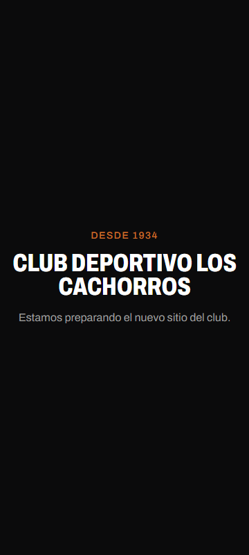
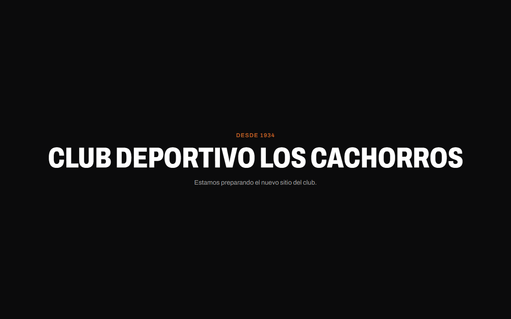
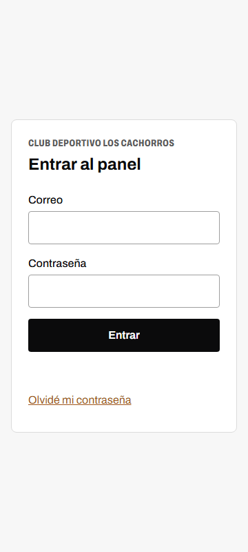
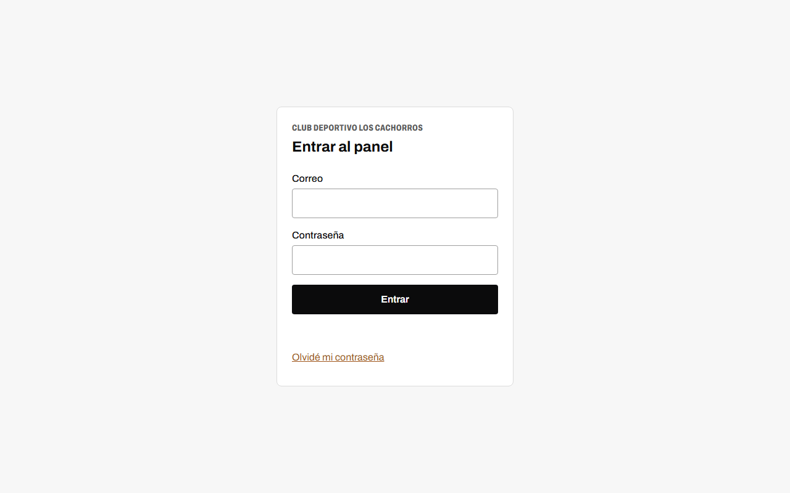
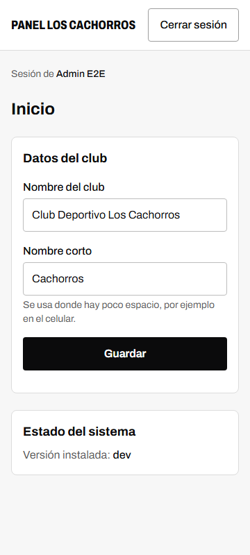
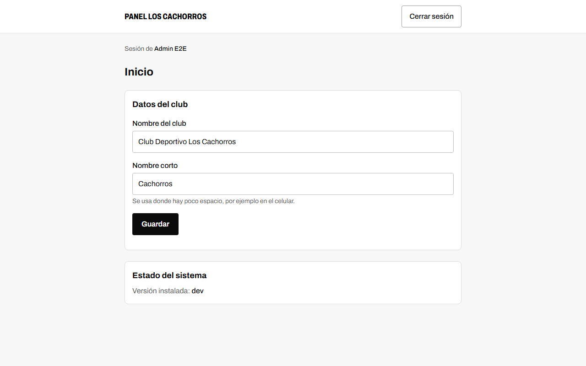

# Fase 0 — Cimientos · reporte de cierre

- **Rama:** `fase-0-cimientos`
- **Fecha:** 7 de octubre de 2026
- **Objetivo:** proyecto ejecutable, verificable y desplegable desde el primer día.

## Qué quedó hecho

| Entregable | Estado | Dónde |
|---|---|---|
| Next.js 16 + TypeScript estricto + Tailwind v4 | Hecho | `next.config.ts`, `tsconfig.json`, `src/styles/` |
| Biome + lefthook + commitlint + Renovate | Hecho | `biome.json`, `lefthook.yml`, `commitlint.config.mjs`, `renovate.json` |
| Vitest + Playwright (+ axe) | Hecho | `vitest*.config.ts`, `playwright.config.ts`, `tests/` |
| `compose.dev.yaml` con PostgreSQL 18 y Mailpit | Hecho | `compose.dev.yaml` |
| `env.ts`, `instrumentation.ts`, logger pino, `/api/health` | Hecho | `src/lib/env.ts`, `src/instrumentation*.ts`, `src/lib/logger.ts`, `src/app/api/health/` |
| Drizzle + primera migración | Hecho | `src/db/`, `drizzle/0000_inicial.sql` |
| Better Auth: login, logout, recuperación, `admin:create`, `/admin` protegido, `requirePermission` | Hecho | `src/lib/auth/`, `src/features/auth/`, `src/app/admin/` |
| `ci.yml` con build sin BD | Escrito; **falta verlo correr en GitHub** | `.github/workflows/ci.yml` |
| Dockerfile multi-stage que construye y arranca | Hecho | `Dockerfile`, `.dockerignore` |
| `AGENTS.md`, `CLAUDE.md`, ADRs 0001–0006, README | Hecho | raíz, `docs/adr/` |

Además: patrón de Server Actions de la sección 3.5 funcionando de punta a punta
(`src/features/settings/actions.ts`: autorización → validación → transacción → auditoría → invalidación →
resultado tipado), rol de base de datos restringido para la app y scripts de consola empaquetados con esbuild.

## Criterios de aceptación

| Criterio | Resultado | Evidencia |
|---|---|---|
| Desde un clon limpio, el README levanta el proyecto en ≤ 15 min | **Parcial** | Cada paso del README se ejecutó en esta máquina y funciona. No se cronometró desde un clon limpio ni lo hizo otra persona. |
| `pnpm check` y `pnpm test` en verde | Cumple | Biome sin hallazgos, `tsc` sin errores, 20 pruebas unitarias |
| CI en verde en el PR | **Pendiente** | El workflow no ha corrido todavía en GitHub |
| `pnpm build` y `docker build` sin acceso a la BD | Cumple | `pnpm build` no abre conexiones; `docker build` terminó sin BD y sin `.env` |
| Si falta una variable obligatoria, la app no arranca y explica cuál | Cumple | El proceso termina con código 1 y lista en español cada variable (probado con `pnpm start` y con la imagen); 5 pruebas unitarias |
| `/admin` sin sesión redirige al login | Cumple | e2e; también con una cookie inventada (la rechaza el layout, no el proxy) |
| Una Server Action protegida rechaza llamadas sin sesión | Cumple | Integración: sin sesión, con cookie inventada y con sesión sin permiso; no escribe ni audita |
| El email de recuperación llega a Mailpit | Cumple | e2e: llega, el enlace permite crear la contraseña nueva y la anterior deja de servir |
| La imagen arranca junto a PostgreSQL y `/api/health` responde `ok` | Cumple | `{"status":"ok","db":"ok","version":"fase0-local"}`; contenedor `healthy`, usuario `app`, ≈ 51 MB de RAM en reposo |

Totales: 20 pruebas unitarias, 21 de integración y 20 e2e (10 por viewport), todas en verde. `pnpm audit --prod`
sin vulnerabilidades conocidas.

## Qué falta

1. **Ver el CI en verde** en el PR (único criterio no verificado).
2. Cronometrar el arranque desde un clon limpio, idealmente con otra persona.
3. La imagen pesa **311 MB**; el objetivo de la sección 12.2 es ≤ 250 MB. Se ajusta en la Fase 5 junto con el
   Dockerfile final (candidato: no empaquetar dos veces las dependencias de los scripts).

## Versiones instaladas

Node 24 LTS · pnpm 12.8.2 · Next.js 16.3.8 (exacta) · React 19.3.0 · TypeScript 6.0.3 (exacta) · Tailwind 4.3.3 ·
Drizzle ORM 0.45.3 / drizzle-kit 0.31.11 · Better Auth 1.7.7 · Zod 4.6.5 · pino 10.3.1 · Nodemailer 10.0.13 ·
Biome 2.5.15 · lefthook 2.1.15 · Vitest 5.0.3 · Playwright 1.63.0 · PostgreSQL 18 · Mailpit 1.31.

Varias quedaron un parche por debajo de la última publicada: es el efecto buscado de la regla de 7 días.

## Decisiones del arranque (aprobadas)

| Tema | Decisión |
|---|---|
| TypeScript | **6.0.3**, no la 7. Pasar a TypeScript 7 (compilador nativo) queda como **mejora futura vía Renovate**, cuando se confirme la compatibilidad de drizzle-kit, Better Auth y Next. |
| Next.js | **16.3.8** fijada exacta (no la 16.4.0, publicada el día anterior al arranque). |
| pnpm | **12.8.2**: la versión 12.x más reciente con 7 días o más de publicada (12.9.x y 12.10.x eran más nuevas). |
| Versiones nuevas | Antigüedad mínima de **7 días** en pnpm (`minimumReleaseAge: 10080`) y en Renovate (`minimumReleaseAge: "7 days"`). Las alertas de seguridad de Renovate quedan exentas para poder parchar Next/React en 48 h. |
| Docker Compose | «v2» en la especificación = plugin `docker compose`; la v5 local es válida. Sin ADR. |
| Drizzle | 0.45.x: la 1.0 sigue en *release candidate* (ADR 0003). |

## Defaults aplicados sin preguntar

No hay desviaciones de arquitectura (ningún ADR de excepción). Estos son los defaults razonables que tomé:

1. **Login y recuperación por `/api/auth`, no por Server Actions.** Los formularios usan el cliente de Better Auth
   para que el rate limit de la librería (que solo actúa sobre peticiones HTTP) proteja el login. Son mínimos, con
   Tailwind y sin shadcn/ui, como se acordó.
2. **El rate limit de Better Auth se desactiva con `SITE_ENV=development`**, para no entorpecer pruebas locales y
   e2e. En staging y producción está activo y guarda sus contadores en la BD; lo verifica
   `tests/integration/rate-limit.test.ts` (429 tras intentos repetidos en staging y production, nunca en development).
3. **La validación de entorno se omite durante `next build`** (detectado por `NEXT_PHASE`), además de con
   `SKIP_ENV_VALIDATION=1`. Así `pnpm build` y el CI compilan sin variables; la validación ocurre al arrancar.
4. **Puerto 5439 para PostgreSQL de desarrollo.** En esta máquina el 5432, 5433 y 5434 ya estaban ocupados por
   otros proyectos.
5. **Scripts de consola con esbuild** (`node scripts/run.mjs <nombre>`) en vez de agregar `tsx`: cero dependencias
   nuevas y el mismo empaquetado que usa la imagen.
6. **`pnpm start` arranca el output standalone** (`node .next/standalone/server.js`) y `postbuild` copia los
   estáticos, porque `next start` no corresponde con `output: 'standalone'`.
7. **Tablas de Better Auth:** generadas con su CLI; solo se cambiaron las fechas a `timestamptz`. Los ids son texto
   (excepción prevista en la sección 8.1), por eso `audit_log.user_id` es `text`.
8. **`site_settings`** se crea sin `featured_series_id` ni `share_card_sponsor_id`: se agregan en la Fase 1 junto
   con las tablas a las que apuntan. La migración inserta la fila única con los datos confirmados (nombre,
   nombre corto «Cachorros» y fundación 1934-04-01).
9. **2FA TOTP** se deja para la Fase 2 (gestión de usuarios). **Testing Library** se instala cuando haya
   componentes que probar (Fase 1). Ninguno era entregable de esta fase.
10. **Tokens de diseño y tipografía Archivo** ya están cargados (sección 4.2 tal cual), porque la pantalla de login
    los necesita. El test de contraste y el resto del sistema de diseño son de la Fase 1.
11. **`[VERIFICAR]` resueltos:** PostgreSQL 18 guarda los datos en `/var/lib/postgresql/18/docker` (el volumen se
    monta en `/var/lib/postgresql`); `next/font` acepta `axes: ['wdth']` para Archivo.

## Cómo probarlo

```powershell
pnpm i
Copy-Item .env.example .env                 # y completar BETTER_AUTH_SECRET (ver README)
docker compose -f compose.dev.yaml up -d
pnpm db:migrate
pnpm admin:create
pnpm dev
```

1. <http://localhost:3000/admin> → redirige a `/admin/login`.
2. Entra con el usuario creado → panel «Inicio»; cambia el nombre corto y guarda → «Guardado.».
3. Cierra sesión → «Olvidé mi contraseña» → el correo aparece en <http://localhost:8025>.
4. <http://localhost:3000/api/health> → `{"status":"ok","db":"ok","version":"dev"}`.
5. Borra `BETTER_AUTH_SECRET` de `.env` y corre `pnpm build` y luego `pnpm start`: no arranca y dice cuál falta.

Verificación completa:

```powershell
pnpm check
pnpm test
pnpm test:integration
pnpm build
pnpm test:e2e
docker build -t cachorros-web:local .
```

## Capturas

| | 360 px | 1280 px |
|---|---|---|
| Portada provisional |  |  |
| Login |  |  |
| Panel |  |  |

Se regeneran con `$env:CAPTURAS = 'fase-0'; pnpm test:e2e capturas`.

## Notas para la Fase 1

- Las pruebas e2e dejan tres usuarios `e2e-*@cachorros.test` en la base local; `pnpm db:reset` los elimina.
- Next copia `.env` dentro de `.next/standalone` al compilar en local. No afecta a la imagen (`.dockerignore`
  excluye `.env`), pero conviene saberlo.
- El disco de la máquina de desarrollo se llenó durante esta fase (ver el mensaje de cierre): Docker y los builds
  necesitan varios GB libres.
