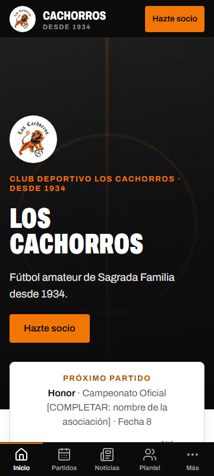
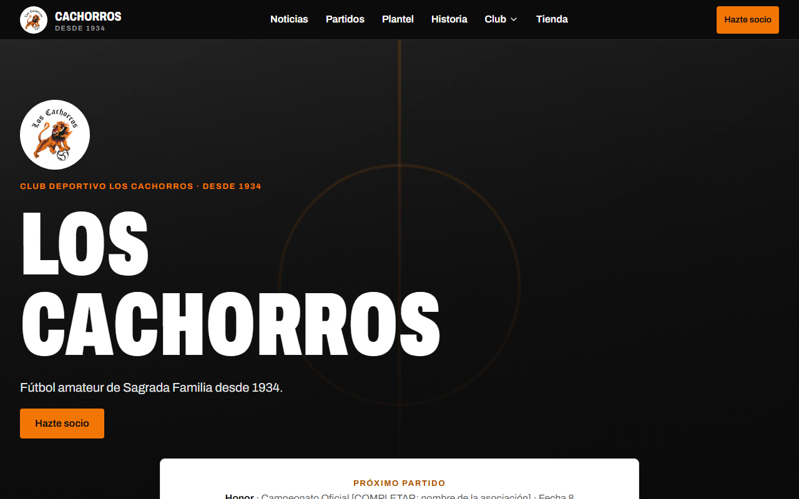
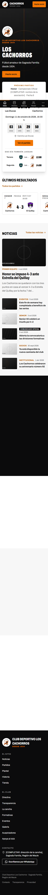
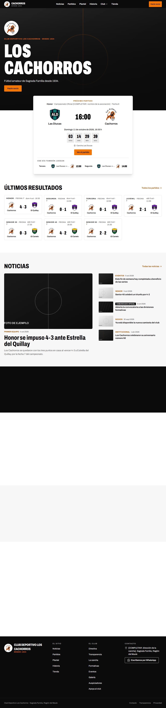
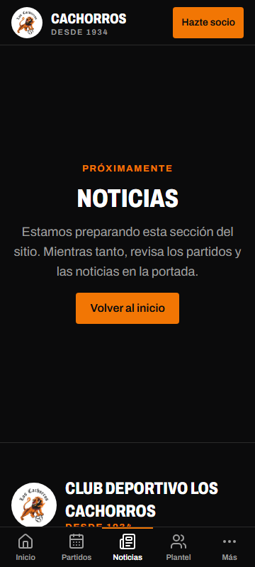
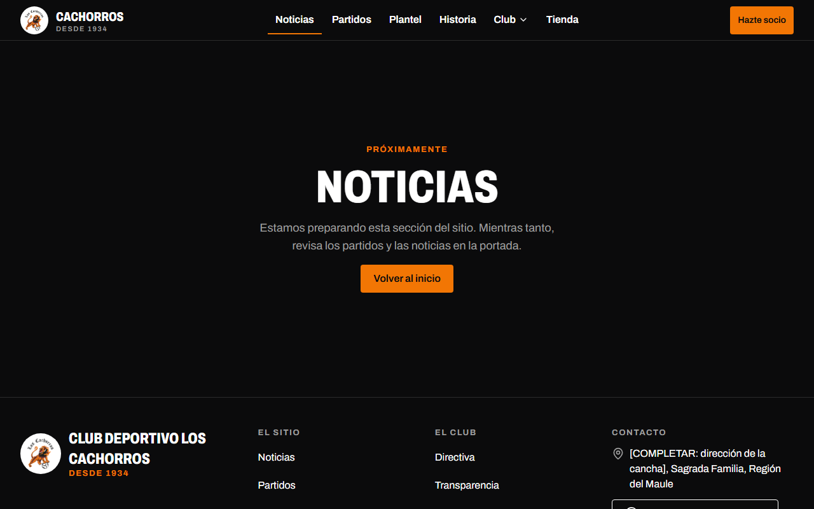



# Fase 1 — Modelo de datos, seed, sistema de diseño y portada · reporte de cierre

- **Rama:** `fase-1-diseno-y-portada`
- **Fecha:** 8 de octubre de 2026
- **Objetivo:** esquema completo, datos de ejemplo, sistema de diseño y la portada real funcionando con el seed.

## Qué quedó hecho

| Entregable | Estado | Dónde |
|---|---|---|
| Esquema completo, migraciones, vista de estadísticas y restricciones | Hecho | `src/db/schema/`, `drizzle/0001_modelo_completo.sql`, `drizzle/0002_vista_estadisticas.sql`, `docs/modelo-de-datos.md` |
| Reglas de dominio de 8.6 como lógica pura y probada | Hecho | `src/features/matches/lib/`, `src/features/players/lib/is-minor.ts` |
| Formatos chilenos, slugs, RUT, reloj inyectable, etiquetas y tags de caché | Hecho | `src/lib/` |
| Núcleo del pipeline de imágenes (adelantado de la Fase 2) | Hecho | `src/lib/images/`, `src/components/site/club-image.tsx`, `src/app/media/` |
| Seed completo (sección 13) | Hecho | `scripts/seed.ts`, `scripts/seed/` |
| `pnpm content:pending` | Hecho | `scripts/content-pending.ts`, `docs/pendientes-contenido.md` |
| Tokens, tipografía, componentes base, de partidos y de contenido | Hecho (alcance acordado) | `src/styles/`, `src/components/ui/`, `src/features/*/components/` |
| Layout público: encabezado, barra inferior, hoja «Más», pie | Hecho | `src/components/site/`, `src/app/(public)/layout.tsx` |
| `/admin/sistema-de-diseno` | Hecho | `src/app/admin/(panel)/sistema-de-diseno/` |
| Portada completa con datos del seed | Hecho | `src/app/(public)/page.tsx`, `src/components/site/home-sections.tsx` |
| `not-found`, `error` y placeholders | Hecho | `src/app/not-found.tsx`, `src/app/(public)/`, `public/placeholder/` |
| `loading` del sitio público | **No se hizo, a propósito** | Ver ADR 0007 |

## Criterios de aceptación

| Criterio | Resultado | Evidencia |
|---|---|---|
| `pnpm db:reset` y `pnpm db:seed` cargan todo; correr el seed dos veces no duplica | Cumple | `tests/integration/seed.test.ts` compara los conteos de 39 tablas tras la segunda corrida. También se corrió dentro de la imagen Docker contra una base vacía |
| Integración de las unicidades y restricciones de 8.6 | Cumple | `tests/integration/constraints.test.ts` (15 casos) y `stats-view.test.ts` (5) |
| Unitarias del marcador derivado, la tabla calculada e `isMinor` | Cumple | `tests/unit/matches-lib.test.ts`, `tests/unit/domain-lib.test.ts`; cobertura de `src/features/*/lib` ≈ 98 % |
| Test de contraste de tokens en verde | Cumple | `tests/unit/tokens-contrast.test.ts` (22 casos) |
| Portada correcta en 360, 768 y 1280 px, sin scroll horizontal ni CLS visible | Cumple | e2e: sin desborde y CLS ≤ 0,1 en los tres anchos (medido: 0 a 0,03) |
| Lighthouse móvil local ≥ 90 / 95 / 95 / 95 | **Parcial: rendimiento no llega** | Accesibilidad 100, Buenas prácticas 100, SEO 100. **Rendimiento 80–84** en cinco corridas (se pide 90). Detalle abajo |
| Cuenta regresiva correcta en `America/Santiago`, incluido el cambio de horario, sin errores de hidratación | Cumple | Unitarias con las transiciones de abril y septiembre de 2026; la e2e de la portada falla ante cualquier error de consola |
| Navegación completa con teclado y foco visible; axe sin *serious/critical* | Cumple | e2e: enlace «Saltar al contenido», foco visible en cada parada, desplegable «Club», hoja «Más»; axe sin violaciones |
| Ningún dato del club inventado | Cumple | `docs/pendientes-contenido.md`: 197 marcadores (122 en la base, 75 en el código y el seed) y 6 campos de Configuración sin completar |

Totales: **99** pruebas unitarias, **51** de integración y **36** e2e (18 por viewport), todas en verde.
`pnpm check` y `pnpm build` en verde; el build se verificó además apuntando a una base inexistente.

### Lighthouse: lo que falta

Cinco corridas con red 4G lenta y CPU ×4 aplicadas: rendimiento **0,73 · 0,80 · 0,84 · 0,80 · 0,81**.
FCP = LCP ≈ 2,7–2,9 s (el objetivo de LCP es 2,5 s), TBT ≈ 340–480 ms, CLS ≈ 0.

Lo que se revisó:

- El servidor no es el problema: la portada sale en ≈ 10–20 ms con la caché tibia (≈ 160 ms en frío) y pesa
  30 KB comprimida; el total de la página es ≈ 340 KB.
- Sin limitar la CPU, el navegador gasta ≈ 30–60 ms en layout y ≈ 50–65 ms en scripts. Con CPU ×4 esos tiempos
  se multiplican y retrasan el primer pintado.
- El puntaje varió entre 0,59 y 0,84 según la corrida: en esta máquina corren otros contenedores a la vez.
- Ya se aplicó: imagen del hero precargada con prioridad alta, `content-visibility` en las capas bajo el
  pliegue, una sola fuente autoalojada y cero scripts de terceros.

Queda pendiente: volver a medir en una máquina sin carga (o en el CI) y, si sigue bajo 90, reducir el JavaScript
de hidratación de la portada. No lo doy por cumplido.

## Qué falta

1. **Rendimiento de Lighthouse** (arriba).
2. **Foto del hero:** el escudo que dejaste en `public/placeholder/escudo.svg` ya está en uso; no había foto, así
   que el hero usa una imagen de ejemplo. Para cambiarla: deja `public/placeholder/hero.jpg` (y, opcional,
   `hero-movil.jpg`) y corre `pnpm db:seed`.
3. **Aprobar el ADR 0007** (render sin *streaming*).
4. La imagen Docker pesa **323 MB** (311 MB en la Fase 0; objetivo ≤ 250 MB en la Fase 5).

## Desviaciones y ADRs

- **[ADR 0007](../adr/0007-render-publico-sin-streaming.md) — pendiente de tu aprobación.** La especificación pide
  `<Suspense>` con *skeletons* (3.6) y, a la vez, páginas públicas que funcionen sin JavaScript (3.3). Con
  *streaming*, sin JavaScript la portada se queda en los *skeletons*. Apliqué un único `<Suspense>` en el layout
  raíz: el HTML llega completo. Por eso no hay `loading.tsx` público. Es reversible.
- **Rutas provisionales explícitas, no una ruta comodín.** Con una ruta comodín, una dirección inexistente
  respondía 200. Cada sección por construir tiene su `page.tsx` «Próximamente» (29 archivos mínimos) y lo demás
  es un 404 real.
- **Una migración para el modelo completo**, no una por dominio como decía el plan: las claves foráneas cruzadas
  entre dominios (`matches` ↔ `albums`, `site_settings` → `series` y `sponsors`) obligaban a generarla junta.
- **Alcance de componentes** (acordado): quedan para su fase `PlayerCard`, `StaffCard`, `ProductCard`,
  `HistoryTimeline`, `GalleryGrid`, `Lightbox`, `VideoFacade`, `MapFacade`, `DocumentList`, `BoardMemberCard`,
  `CopyBlock` y `Breadcrumbs` (ninguna página de esta fase los usa).
- **`Toast`:** está el componente visual; la cola y el temporizador llegan con el panel (Fase 2).

## Decisiones que tomé (defaults)

Además de los 10 defaults del plan, ya aceptados:

1. **Color de acento `#f27604`**, tomado del león del escudo entregado. Sobre blanco no alcanza contraste ni
   para texto grande (2,9:1), así que la regla de 4.2 cambia: sobre fondo claro se usa `accent-strong`
   (`#b05500`, 5,1:1) para texto, enlaces e indicadores; `accent` queda para botones (texto negro encima) y
   secciones oscuras. `[VERIFICAR: color oficial con la directiva]`
2. **El texto secundario claro usa `neutral-600`**, no `neutral-500`: también va sobre fondos grises, donde 500
   no alcanza AA (lo detectó axe).
3. **Escudos sobre un disco blanco en las secciones oscuras:** el escudo tiene letras y trazos negros que
   desaparecerían sobre negro. No modifiqué el escudo.
4. **WhatsApp de ejemplo `+56900000000`** en Configuración, para que los botones se vean en la demo.
   `content:pending` lo reporta como pendiente.
5. **Coordenadas de ejemplo** de la cancha: el centro de la comuna, marcado `[COMPLETAR]`.
6. **Cuotas y precios de ejemplo** (3.000 / 5.000 / 1.500; productos entre 8.000 y 25.000), marcados
   `[COMPLETAR]` en su descripción.
7. **Ids deterministas en el seed** (además del slug): es lo que permite repetirlo sin duplicar en tablas sin slug.
8. **Partidos entre rivales con `score_locked = true`:** no tienen eventos, así que su marcador no se recalcula.
9. **Dos fuentes Archivo estáticas (OFL) en `src/assets/fonts/og/`:** las usa el seed para dibujar las imágenes
   de ejemplo (la imagen Docker no trae fuentes) y servirán para las tarjetas de la Fase 4.
10. **`/media/*` en desarrollo** lo sirve la app; con `SITE_ENV` distinto de `development` responde 404.
11. **`pnpm start` usa `scripts/start.mjs`:** el servidor standalone cambia de carpeta y las rutas relativas de
    `.env` dejaban de apuntar a `data/uploads`.
12. **Ícono del sitio** (`src/app/icon.png`) generado desde el escudo; los íconos de la PWA son de la Fase 4.
13. **Biome no revisa `public/`** (son archivos del club).
14. **Lighthouse con red y CPU aplicadas** (`throttlingMethod: 'devtools'`), no simuladas: en localhost la
    simulación daba un LCP irreal. Con la simulada el rendimiento fue 0,64–0,83.

## Cómo probarlo

```powershell
docker compose -f compose.dev.yaml up -d
pnpm db:reset
pnpm db:seed
pnpm admin:create
pnpm dev
```

1. <http://localhost:3000> → portada completa. Prueba el celular (360 px): barra inferior y «Más».
2. `pnpm db:seed --en-vivo` y recarga (hasta 30 s de caché) → franja EN VIVO. `pnpm db:seed` la quita.
3. <http://localhost:3000/noticias> → «Próximamente». <http://localhost:3000/no-existe> → 404.
4. <http://localhost:3000/admin/sistema-de-diseno> → tokens y componentes con sus estados.
5. Desactiva JavaScript en el navegador y recarga la portada: el contenido sigue ahí.
6. `pnpm content:pending` → `docs/pendientes-contenido.md`.

Verificación completa:

```powershell
pnpm check
pnpm test
pnpm test:integration
pnpm build
pnpm test:e2e
pnpm lighthouse
```

## Capturas

| | 360 px | 1280 px |
|---|---|---|
| Portada |  |  |
| Portada completa |  |  |
| Sección provisional |  |  |
| Sistema de diseño |  |  |

En la captura completa a 360 px la barra inferior aparece a media página: es un efecto de la captura de página
entera con elementos fijos, no del sitio.

Se regeneran con `$env:CAPTURAS = 'fase-1'; pnpm test:e2e capturas`.

## Notas para la Fase 2

- `notFound()` en páginas de detalle responderá 200 con el esquema actual (ver ADR 0007): hay que resolverlo al
  construir `/noticias/[slug]` y `/partidos/[slug]`.
- La franja *matchday* se cachea 30 s; el polling llega en la Fase 4.
- En la imagen Docker, Pango no distingue la variante condensada de Archivo: los rótulos de las imágenes de
  ejemplo salen en la variante normal. Es solo estético y afecta únicamente a los placeholders.
- Las pruebas e2e cargan el seed al empezar: tardan unos 40 s más.
