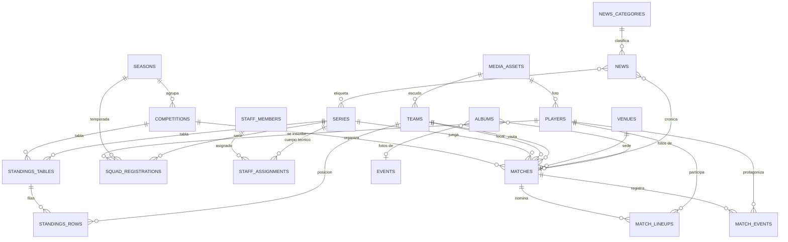

# Modelo de datos

Resumen del esquema (especificación, sección 8). La fuente exacta es el código: `src/db/schema/*.ts` y las
migraciones revisadas de `drizzle/`.

## Convenciones

- PostgreSQL 18, esquema `public`, tablas en plural y `snake_case`.
- PK `id uuid default uuidv7()`. Excepción: las tablas de Better Auth (`user`, `session`, `account`,
  `verification`, `rate_limit`, `two_factor`) usan ids de texto.
- `created_at` y `updated_at` como `timestamptz` en UTC; se muestran en `America/Santiago`.
- FKs indexadas. `ON DELETE RESTRICT` por defecto; `CASCADE` solo para hijos puros (eventos y nómina de un
  partido, ítems de álbum, variantes e imágenes de producto, clics de auspiciador); `SET NULL` en referencias
  opcionales a usuarios y en los punteros de `site_settings`.
- Sin *soft delete* genérico: se usan estados (`is_active`, `status`, `is_published`).
- Dinero en CLP como `integer` con `CHECK (>= 0)`. Teléfonos como texto E.164.
- Texto enriquecido en `jsonb` (documento ProseMirror) más una columna de texto plano cuando hace falta.

## Archivos del esquema

| Archivo | Tablas |
|---|---|
| `auth.ts` | `user`, `session`, `account`, `verification`, `rate_limit` y `two_factor` (Better Auth). `two_factor` guarda cifrados el secreto TOTP y los códigos de respaldo de quien activó la verificación en dos pasos (migración `0003`) |
| `system.ts` | `audit_log`, `site_settings`, `page_blocks`, `slug_redirects`, `ops_runs` |
| `media.ts` | `media_assets` |
| `sport.ts` | `seasons`, `series`, `competitions`, `teams`, `venues`, `matches`, `match_events`, `match_lineups`, `players`, `squad_registrations`, `staff_members`, `staff_assignments`, `player_stat_adjustments`, `standings_tables`, `standings_rows`, `training_schedules` y la vista `v_player_season_stats` |
| `content.ts` | `news_categories`, `news`, `news_series`, `albums`, `album_items`, `videos`, `social_posts`, `history_milestones`, `honours`, `hall_of_fame`, `historic_kits` |
| `club.ts` | `board_members`, `documents`, `events`, `sponsors`, `sponsor_clicks_daily`, `product_categories`, `products`, `product_images`, `product_variants`, `membership_plans`, `membership_requests`, `members`, `sponsorship_inquiries`, `contact_messages` |

## Núcleo deportivo

## Reglas que hace cumplir la base

| Regla | Cómo |
|---|---|
| Un solo club propio | Índice único parcial `teams_own_club_uq WHERE is_own_club` |
| Una sola temporada actual | Índice único parcial `seasons_current_uq WHERE is_current` |
| Jugador inscrito una vez por temporada y serie | Único `(player_id, season_id, series_id)` |
| Número de camiseta único por temporada y serie | Único parcial `(season_id, series_id, shirt_number) WHERE shirt_number IS NOT NULL` |
| Eventos idempotentes (consola en vivo) | Único `match_events.client_event_id` |
| Un jugador una vez por nómina | Único `(match_id, player_id)` |
| Un equipo no juega contra sí mismo | `CHECK (home_team_id <> away_team_id)` |
| Crónica exige partido; galería exige álbum | `CHECK` en `news` |
| Lo publicado o programado tiene fecha | `CHECK` en `news` |
| Álbum con menores no se publica sin confirmación | `CHECK` en `albums` |
| Una imagen exige texto alternativo | `CHECK` en `media_assets` |
| Todo evento que no sea comentario tiene equipo | `CHECK` en `match_events` |
| Fila única de configuración | `CHECK (id = 1)` en `site_settings` |
| PJ y DIF de la tabla manual | Columnas generadas `played` y `goal_diff` en `standings_rows` |

Todas tienen prueba en `tests/integration/constraints.test.ts`.

## Datos derivados

- **Marcador:** `home_score` / `away_score` se derivan de los eventos (`src/features/matches/lib/score.ts`) y se
  recalculan en la misma transacción de cada cambio. Excepción: `score_locked = true` (W.O., por secretaría y
  partidos entre rivales cargados solo con su resultado).
- **Estadísticas:** vista `v_player_season_stats` (por jugador, temporada y serie; solo partidos `finalizado`;
  suma `player_stat_adjustments`). Se crea en `drizzle/0002_vista_estadisticas.sql` y se declara en TypeScript con
  `pgView(...).existing()`. Segunda amarilla = 1 amarilla + 1 roja `[VERIFICAR: criterio con la directiva]`.
- **Tabla de posiciones:** `standings_tables.mode` es `manual` (filas en `standings_rows`) o `calculada` (desde
  los partidos finalizados de la competencia y la serie, incluidos los partidos entre rivales). Los puntos salen
  de `competitions.points_win` / `points_draw`; desempate por PTS, DIF, GF y posición manual
  (`src/features/matches/lib/standings.ts`).
- **Menores de edad:** no es una columna. Lo decide `isMinor(player, registrations, today)`
  (`src/features/players/lib/is-minor.ts`), la única regla que usan los DTOs públicos.

## Diseño para el futuro (no implementado en v1)

La especificación (8.8) deja previsto, sin crear tablas todavía:

| Futuro | Qué existe hoy | Qué se agregaría |
|---|---|---|
| Login de socios | `members.user_id` (nulo) | Rol `socio` en Better Auth y área privada |
| Carnet digital con QR | `members.qr_token` (nulo, único) | Token firmado y rotable; página de verificación |
| Cuotas y pagos | `membership_plans`, `members` | Tabla `membership_payments` (socio, período, monto, estado, medio de pago) |
| Delegado acotado por serie | `USER_ROLES` ya incluye `delegado` | Tabla `user_series_scopes` (usuario, serie) y chequeo en `permissions.ts` |
| Notificaciones push de goles | PWA (Fase 4) | Tabla `push_subscriptions` (endpoint, claves, series seguidas) |
| Pago online en la tienda | `products`, `product_variants` | Tablas `orders` y `order_items`; proveedor `[DECIDIR: Webpay, Flow, Mercado Pago o Khipu]` |
